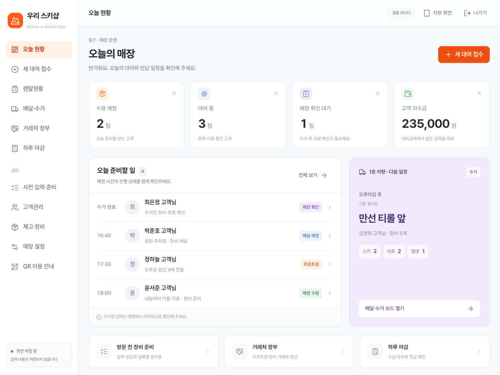
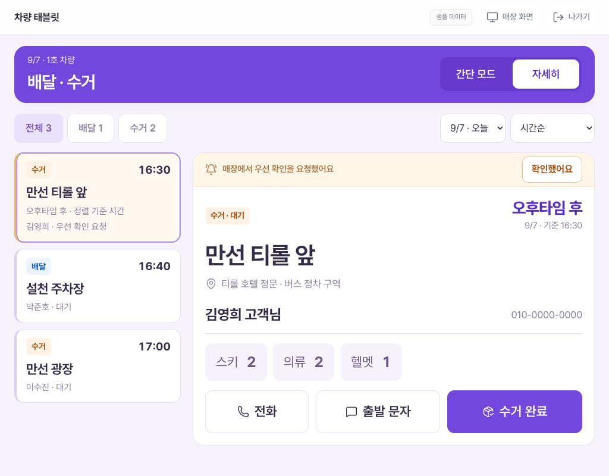

# 스키 렌탈샵 운영 시스템

작성일: 2026-09-07 · 문서 버전: 0.9 · 프로젝트명: `ski-rent-ops`

프로젝트 위치: `/Users/sookwan/Developer/ski-rent-ops`

카운터와 차량이 같은 배달·수거·반납 정보를 공유하고, 대여 접수부터 견적·결제 기록·하루 마감까지 이어지는 시스템의 기획 프로젝트입니다. 부모님 매장에서 먼저 시험하고, 이후 다른 렌탈샵도 각자의 상품·요금·장소·직원 설정으로 사용할 수 있도록 설계합니다.

**[운영 화면 체험하기](https://rosookwan.github.io/ski-rent-ops/)** · [GitHub 저장소](https://github.com/rosookwan/ski-rent-ops)

로그인 화면에서 **매장 POS** 또는 **차량 화면**으로 들어가 모든 메뉴를 눌러볼 수 있습니다. 이번 버전은 화면 체험용이며, 실제 로그인·고객 저장·문자 발송·결제·기기 간 동기화는 연결하지 않았습니다. 이름·연락처·가격·재고는 가상 예시입니다.

0.9에서는 오늘 현황, 렌탈현황과 상세, 매장 설정, 재고·정비, 거래처 장부, 하루 마감, 사전 사이즈 입력·준비표, QR 이용 안내, 임시 로그인을 연결했습니다. 매장은 Makaryo의 밝은 바탕과 주황 포인트, 차량은 Task management의 보라색과 둥근 업무 카드를 참고했습니다. Pretendard 한글 폰트와 아이콘을 포함해 다른 컴퓨터에서도 같은 모습으로 열립니다.

**2026-09-08 UI 갱신:** 제공된 11개 화면을 기준으로 글꼴·여백·색상·표와 팝업을 맞추고, 전체 메뉴를 기본 접힘으로 통일했습니다. 접수의 3열 배치와 하단 합계, 차량의 간단·상세 모드도 조정했습니다. [적용 범위와 검증 결과](docs/12-ui-reference-implementation.md)를 참고하세요.

**반납 기능 1.0 추가:** 리프트권 단독 접수·회수, 품목별 일부 반납, 일정 분리, 차량 인수와 매장 확인, 수량 정정·이력, 장당 1,000원 기준 집계를 화면과 분리해 구현했습니다. SQLite 저장 API와 변경분 동기화 클라이언트도 포함합니다. 의류·리프트권은 직접반납이 기본이며 사유 종류는 보류했습니다.

현재 버튼은 새 반납 기능에 연결하지 않았습니다. Pages에는 `SkiOps.returns` 메모리 체험 모듈이 포함되며 실제 API 서버·영구 저장·기기 간 공유는 연결하지 않았습니다. [기능·API·실행 설명](docs/10-return-functions.md)과 [후속 UI 프롬프트 3개](docs/11-return-ui-handoff.md)를 참고하세요.

아래 이미지는 초기 시안입니다. 최신 UI는 위의 운영 화면 링크에서 확인할 수 있습니다.

| 매장 POS | 차량 태블릿 |
|---|---|
|  |  |

## 실행과 확인

Python 3와 Node.js 22 이상, 브라우저 확인용 Google Chrome을 사용합니다. 정적 HTML 빌드는 Python 표준 라이브러리만 필요합니다.

```sh
python3 scripts/build.py --serve --port 58148
```

[로컬 화면](http://127.0.0.1:58148/)을 열면 됩니다. 서버를 실행한 채 소스를 수정하고 새로고침할 수 있습니다. `scripts/build.py` 자체를 바꿨을 때는 서버를 다시 실행합니다.

```sh
npm ci
npm run check
npm test
npm run test:visual
npm run test:returns
npm run test:returns:browser
```

브라우저 검사는 위의 로컬 서버가 실행 중이어야 합니다. `npm test`는 클릭 흐름 30개, `npm run test:visual`은 화면 크기·차량 버튼 검사 37개를 수행합니다. 검사 결과와 캡처는 Git에서 제외한 `work/`에 생성됩니다. 배포 주소에서도 `SKI_DEMO_URL=https://rosookwan.github.io/ski-rent-ops/ npm test`로 같은 동작을 확인할 수 있습니다.

`npm run build` 결과는 `dist/index.html`입니다. `main`에 푸시하면 GitHub Actions가 구문 검사와 빌드 후 Pages를 갱신합니다. Pages 설정의 빌드 소스는 **GitHub Actions**입니다. 자세한 구현 범위와 검증은 [화면 체험과 검증 기록](docs/09-clickable-demo-and-validation.md)에 정리했습니다.

`test:returns`는 도메인·SQLite·HTTP·클라이언트를 자동 검증합니다. `test:returns:browser`는 실행 중인 로컬 화면 또는 `SKI_DEMO_URL`의 모듈을 검증합니다. Actions에서도 반납 기능 검사를 수행합니다. SQLite API는 Node 22.13 이상에서 실행하며 [로컬 실행 방법](docs/10-return-functions.md#로컬-저장-api-실행)을 따릅니다.

## 결정 상태

| 구분 | 내용 |
|---|---|
| 사용자와 확정 | 배달·수거·매장 직접 반납 보드, 실시간 공유, 전화·문자 버튼, 기사님 알림, 수거 완료와 반납 완료 구분 |
| 사용자와 확정 | 첫 버전은 웹앱/PWA. 매장 PC·터치모니터와 차량 태블릿에서 사용. 차량 기기는 안드로이드 우선, 정확한 기종 미정 |
| 사용자와 확정 | 간단·자세한 모드, 큰 글자·버튼, 충전 중 화면 유지, 실제 기기로 시험 후 개선 |
| 사용자와 확정 | 반납은 오후타임 후·야간타임 후·익일 오전 또는 직접 날짜·시간 선택. 차량 수거와 매장 직접 반납에 공통 적용 |
| 사용자와 확정 | 매장 POS 모니터와 차량 갤럭시 탭의 배치·스타일을 각각 다르게 구성 |
| 사용자 요청 반영 | 고객 대표자 이름·연락처 검색과 장비별 이용 내역, 미래 이용 시작·종료일 선택, 장비당 정액 할인·메인 총 금액 할인 누적 적용 |
| 사용자 요청 반영 | POS 글자·버튼 크기 유지, 상하 여백 소폭 축소. 장비 / 리프트권 별도 탭에서 날짜마다 다른 수량 입력, 같은 수량을 모든 이용일에 적용 |
| 이번 입력 설계 | 날짜별 이용 수량으로 요금 합산. 실제 지급·마지막 수거 수량을 별도 확인하며 차량에는 확인한 수거 수량만 전달 |
| 이번 설계 권고 | 상품·요금 관리자, 단골·제휴 요금, 상품 할인, 견적서, 결제 기록, 하루 마감 |
| 사용자 확인 + 입력 설계 | 장비 1개를 2일 빌리면 실제 수량은 1개, 요금은 2일분. 날짜별 이용 수량과 실제 지급 수량을 구분 |
| 이번 설계 권고 | 장비의 다일 요금과 리프트권 날짜·권종별 요금을 분리. 가격·할인 적용 결과를 거래 당시 값으로 보관 |
| 사용자 요청 · 화면 시안 | 타 스키샵 리프트권 매입·판매와 장비 빌려오기·빌려주기 장부, 렌탈현황, 전체 상품·요금·권종 설정 |
| 사용자 요청 · 화면 시안 | 고객용 사전 사이즈 입력, 폼 설정·발송·응답 관리, 날짜별 준비표, 매장 안내 페이지와 QR |
| 이번 설계 권고 | 오늘 현황을 첫 화면으로 사용. 받을 돈/줄 돈과 장비 반환 상태를 구분하고, 부분 반납·교환·재고·정비·마감 연결 |
| 운영 정책 확인 필요 | 실제 가격표, 상품 수량 단위, 야간 이용일 기준, 제휴 정산 방식 |
| 보류 | 개별 장비 바코드·QR 도입, 차량 전용 네이티브 앱 |

문서의 ‘확정’은 대화에서 합의한 기능과 방향을 뜻합니다. 충돌 처리·데이터 구조 등 세부 구현 규칙은 이 방향을 실제로 구현하기 위한 권고안입니다. 신규 요금·할인 정책을 이미 매장 정책으로 적용했다는 뜻은 아닙니다.

## 읽는 순서

| 문서 | 내용 |
|---|---|
| [운영 보드 확정사항](docs/01-operations-board.md) | 매장·차량 업무, 상태, 연락, 화면 모드, PWA 운영 |
| [장비 대여·가격·견적 설계안](docs/02-rental-pricing-quotes.md) | 상품 관리자, 할인 순서, 2일·3일 계산, 견적서와 대여 전환 |
| [하루 마감 보고서 설계안](docs/03-daily-closing.md) | 확정 대여금액·수납·환불·미수·보증금, 제휴 정산, 마감 예시 |
| [다른 매장 확장 구조](docs/04-multi-shop-architecture.md) | 매장별 데이터 분리, 설정, 권한, 공유 데이터 구조 |
| [시험 시나리오와 미정 사항](docs/05-pilot-and-decisions.md) | 실제 기기 시험, 가격 계산 검증, 구현 전에 정할 운영값 |
| [Claude Design용 프롬프트 10개](docs/06-claude-design-prompts.md) | 같은 디자인 프로젝트에서 화면을 단계별로 추가하는 복사용 프롬프트 |
| [디자인 참고 자료와 첫 시안](docs/07-design-reference-and-preview.md) | Figma 자료별 활용, 시안 범위, 검증 및 다음 작업 |
| [전체 화면 구성과 확장 계획](docs/08-screen-map-and-expansion-plan.md) | 공식 렌탈 서비스 비교, 거래처 장부·렌탈현황·설정·사전 입력·QR, 구현 순서 |
| [화면 체험과 검증 기록](docs/09-clickable-demo-and-validation.md) | 구현된 메뉴, 커밋 단위, 테스트, 배포·확장 시 주의점 |
| [첫 시안 소스](design/prototypes/first-look.fragment.html) | 대화 안에서 확인하는 매장·차량 인터랙티브 시안 |
| [계산 예시 데이터](examples/calculation-cases.json) | 가상 금액을 사용한 다일 요금·할인·마감 검산 자료 |

## 전체 업무 연결

고객·상품 선택 → 이용 기간·배달·반납 방법 입력 → 요금·할인 확인 → 견적서 출력 → 대여 확정 → 수령 또는 배달 → 고객 이용 → 차량 수거 또는 매장 직접 반납 → 매장 최종 확인 → 반납 완료.

결제·환불은 이 과정 중 언제든 별도 기록합니다. 물건을 돌려받은 상태와 돈을 모두 받은 상태는 서로 독립적입니다. 하루 마감은 해당 영업일의 확정·변경 내역과 실제 수납·환불 내역을 각각 집계합니다.

## 단계별 작업 범위

1. **운영 보드 시험:** 매장 접수, 차량 배달·수거, 직접 반납, 연락·알림, 수거·반납 완료, 간단·자세한 모드.
2. **대여·금액 관리:** 상품·가격 설정, 단골·제휴 요금, 다일 계산, 할인, 견적서, 결제·환불 기록, 하루 마감. 같은 대여 기록에서 차량 업무로 연결.
3. **사전 사이즈 입력:** 고객이 일행별 정보를 입력하면 기존 대여 건의 준비표로 연결. 제출만으로 예약이나 금액이 확정되지는 않음.
4. **QR 이용 안내:** 매장별 주차·준비물·배달·반납 장소 안내 페이지. 개별 장비에 붙이는 바코드와는 별개.

여러 매장에 필요한 데이터 분리와 매장별 설정은 처음부터 포함합니다. 공개 가입·구독 요금·자동 결제 같은 서비스 판매 기능은 현장 검증 이후 범위입니다.

## 문서 사용 규칙

- 확정사항이 바뀌면 해당 문서와 시험 시나리오를 함께 수정합니다.
- 실제 가격표를 받기 전까지 예시 금액은 데모 전용으로만 사용합니다.
- 표준 상품 목록과 ‘만선 티롤 앞’ 같은 장소는 첫 매장의 설정 예시입니다. 프로그램에 고정하지 않습니다.
- 이 문서의 마감 보고서는 매장 운영 관리용입니다. 세무 신고용 매출 인식·전표와 동일한 것으로 정의하지 않습니다.
