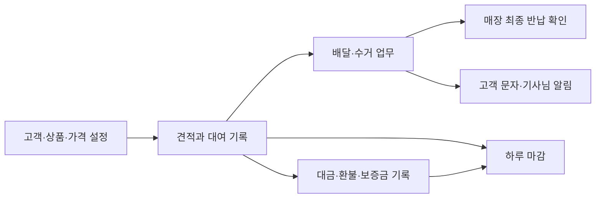

# 다른 렌탈샵 확장을 위한 구조

상태: 기술·데이터 설계 권고 · 2026-09-07

## 기본 원칙

같은 프로그램을 여러 렌탈샵이 쓰되 각 매장은 자기 고객·대여·가격·직원·마감 자료만 봅니다. 첫 매장의 상호·요금·상품·장소를 소스에 고정하지 않고 설정으로 관리합니다. 초기 화면은 한 매장 운영에 집중하되 데이터 경계는 처음부터 매장 단위로 둡니다.

이 문서에서 `shop_id`는 독립 운영하는 렌탈샵의 데이터 구분 단위입니다. 한 업체의 지점은 필요할 때 `branch_id`로 구분합니다. 서로 다른 사업자의 매장을 같은 지점으로 취급하지 않습니다.

## 매장별 설정

| 영역 | 독립적으로 설정할 값 |
|---|---|
| 매장 정보 | 상호, 로고, 연락처, 주소, 시간대, 영업일 마감 경계 |
| 업무 장소 | 배달·수거·직접 반납 장소, 표시 이름, 선택 메모 |
| 운영 | 차량·기사, 업무 배정, 상태별 허용 조작, 알림 기본값 |
| 반납 타임 | 타임 ID·표시 이름·기준 시간·마지막 이용일 대비 날짜 차이·적용 기간·설정 버전. 매장 시간대 적용 |
| 상품 | 상품·옵션·단위·카테고리·회수 여부·정렬 |
| 리프트권 선택 | 스키장·권종·대상 구분·판매 날짜 조건·판매가, 자주 쓰는 권종과 순서. 거래 줄에 사용 날짜·당시 권종명·대상·단가·매수를 보관 |
| 요금 | 가격표 버전, 시즌·날짜 조건, 다일 계산, 단골·제휴 요금·할인 범위 |
| 간편 할인 | 단골 5,000원·10,000원 기본값, 장비당/총 금액 적용 대상, 추후 관리자 수정 권한. 거래에는 당시 금액과 총 할인 클릭 목록을 복사 |
| 거래 | 제휴업체·청구 대상, 사용 결제수단, 보증금 사용 여부 |
| 거래처 장부 | 타 스키샵·업체 정보, 매입·판매·대차 단가, 정산일, 상계 사용 여부 |
| 사전 입력 | 질문 표시·필수 여부·순서, 상품별 사이즈 질문, 고객 링크 수정·만료 기준 |
| 공개 안내 | 매장별 고정 안내 주소, 게시한 내용·FAQ·사진, QR 출력 정보 |
| 문서·연락 | 견적서·마감 인쇄 정보, 문자 문구·발신번호·발송 이력 |
| 직원 | 역할·소속·담당 차량, 금액 수정·마감 등 업무 권한 |

기본 스키 상품·오후/야간/후야 권종·장소 목록은 복사해서 수정할 수 있는 설정 예시로 제공합니다. 실제 가격은 새 매장이 입력하도록 하며 다른 매장의 고객·견적·거래 내역을 초기 데이터로 복사하지 않습니다.

## 공통 데이터 구조

운영 보드와 금액 기능은 같은 대여 기록을 참조합니다. 금액 계산 때문에 늘어난 ‘대수 × 이용일수’를 배달·수거 수량으로 사용하지 않습니다.

반납 업무에는 선택 방식, 타임 ID·이름의 당시 값, 실제 예정 일시, 해석에 사용한 설정 버전과 시간대를 보관합니다. 타임 설정 변경은 신규·작성 중 접수에 적용하고 기존 업무는 유지합니다. 여러 매장 사이에서 같은 ‘야간타임 후’라는 이름을 같은 시간으로 취급하지 않습니다. 차량·매장 화면이 같은 예정 일시를 참조하되 표현과 배치는 각 기기에 맞게 구성합니다.

고객 검색은 현재 매장 안에서만 이름·정규화한 연락처로 수행합니다. 고객 ID와 대여·예약 이력을 연결하되 대표자명이 같다는 이유로 기록을 합치지 않습니다. 접수일, 수령 예정/실제 일시, 청구 이용 시작·종료일, 반납 예정/실제 일시는 분리합니다. 미래 이용 예약이 오늘의 매출·오늘의 수거 업무로 자동 분류되지 않도록 각각의 기준 날짜를 사용합니다.

| 논리 자료 | 주요 내용 |
|---|---|
| Shop / Branch | 독립 매장과 선택 지점, 설정·시간대 |
| Membership / Vehicle | 직원의 매장별 역할, 차량·담당자 |
| Customer / Partner | 매장별 고객·단골 관계·제휴업체·청구 주체 |
| Product / Variant | 상품·옵션·물품 단위·대여 또는 이용권 분류 |
| PricePlan / PriceRuleVersion | 정가·단골·제휴 요금, 적용 기간·계산 방식·버전 |
| Quote / QuoteVersion | 견적과 제시한 당시 상품·가격·할인 값 |
| RentalOrder / OrderLine | 확정 대여와 실제 수량·청구 이용일·보유 기간·금액 기록 |
| DailyUsage / TicketUse | 날짜·상품별 이용 수량·해당 날짜 단가, 리프트권 날짜·권종·대상·매수. 수량을 일수로 다시 곱하지 않음 |
| PhysicalQuantityPlan | 실제 지급 수량, 마지막 수거 예정 수량, 확인 담당자·시각·적용 버전. 일별 수량 변경 시 재확인 |
| FulfillmentJob / JobItem | 배달·수거 업무와 상품별 대상·처리·잔여 수량 |
| ReturnCheck | 매장 최종 확인 수량·상태·시각·담당자 |
| PaymentEvent / Allocation | 대금 수납·환불·보증금 이동과 거래별 배분 |
| ChargeAdjustment | 확정 후 연장·취소·추가·가격 정정 내역 |
| Message / DriverAlert | 발송 대상·문구·결과·요청 ID, 기사 알림 전달·확인 |
| DailyClose / AuditEvent | 마감 확정본·버전, 변경 주체·시각·사유 |
| Partner / PartnerTrade / PartnerTradeLine | 우리 매장의 거래처와 매입·판매·대차 거래, 당시 품목·단가·이용일·수량 |
| PartnerSettlement / SettlementAllocation | 업체 수납·지급·상계·취소 기록과 대상 거래별 배분. 실제 돈 이동과 상계 구분 |
| StockMovement / EquipmentLoan | 입고·출고·반환, 소유 업체·실제 보유 장소·대차 기간, 고객 지급과 연결 |
| IntakeTemplateVersion / IntakeRequest / IntakeResponse | 당시 질문, 연결 예약·대여·준비 요청, 고객 입력 링크·응답·변경 이력 |
| PreparationTask | 수령 예정일 기준 일행별 준비·배정·지급 상태와 적용한 응답 버전 |
| ShopGuide / GuideRevision | 고정 공개 주소와 게시한 안내·FAQ·개정 이력 |

물품이 모두 수거된 상태와 매장에 들어와 확인이 끝난 상태를 따로 저장합니다. 향후 재고 관리에서는 수거 완료만으로 재대여 가능 수량을 늘리지 않습니다. 세척·건조·점검이 필요한 물품은 최종 반납 이후에도 별도 준비 상태로 관리할 수 있게 둡니다.

첫날 4개·둘째 날 3개 이용은 날짜별 요금 데이터입니다. 동일한 장비의 계속 이용인지, 별도 지급인지, 일부가 먼저 반납됐는지는 이 숫자만으로 알 수 없습니다. 실제 지급·반납 이력을 별도 관리하고 차량 업무에는 확인한 잔여 수거 수량을 연결합니다. 시안은 마지막 수거 계획을 수동 확인하며 중간 업무·누적 잔량 검증은 아직 구현하지 않았습니다.

개별 자산 번호는 추후 추가할 수 있도록 구조를 두되, 첫 시험에 모든 장비의 바코드 등록을 요구하지 않습니다. 처음에는 상품·옵션별 수량 관리로 시작합니다.

위 거래처·사전 입력·공개 안내 자료는 0.8의 설계 추가이며 아직 시안에 구현되지 않았습니다. 자세한 연결은 [전체 화면 구성안](08-screen-map-and-expansion-plan.md)을 따릅니다. 타 매장 장비의 이용 가능 기간 종료와 실제 반환 기록은 구분하고, 기한이 지났다고 자동 인수 처리하지 않습니다.

## 매장 경계와 권한

- 매장 자료에는 `shop_id`를 연결하고, 서버는 로그인한 직원의 매장 소속과 역할로 접근 범위를 결정합니다.
- 화면이나 요청값의 `shop_id`를 바꾸는 것만으로 다른 매장에 접근할 수 없게 합니다.
- 대여·상품·결제·견적 등 연결 자료도 같은 매장에 속해야 합니다. 데이터베이스 제약과 서버 검증으로 함께 확인합니다.
- 실시간 구독, 문자 결과 콜백, 파일 저장·다운로드, 검색, 내보내기, 보고서에도 동일한 매장 경계를 적용합니다.
- 기사님에게는 맡은 업무에 필요한 고객 연락처·장소·물품만 제공하고 금액·가격 관리·전체 고객 이력을 기본 제공하지 않습니다.
- 같은 전화번호의 고객이 두 매장에 있어도 두 매장의 고객 이력을 자동 공유하거나 합치지 않습니다.
- 거래처로 등록한 다른 스키샵과 프로그램의 독립 매장 계정은 다릅니다. 같은 서비스 이용 여부만으로 상대 장부·고객·원가를 자동 공유하지 않습니다.
- 사전 입력 링크는 해당 요청의 고객 입력에만 접근하며 직원 화면 권한을 주지 않습니다. 공개 안내·QR에는 게시한 공통 정보만 포함합니다.
- 하나의 사용자가 여러 매장에 속하면 선택한 매장을 명확히 표시합니다. 매장 변경 시 이전 자료·캐시·구독이 남지 않게 합니다.

이 분리는 여러 매장으로 확장한 뒤 뒤늦게 추가하는 기능이 아니라 첫 데이터 모델과 접근 검사에 포함합니다.

## 실시간 변경과 복구

서버 확인 전 로컬 입력을 최종 완료로 표시하지 않습니다. 변경 요청에는 중복 처리 방지 식별자를 두고, 처리 결과를 받지 못해 재시도해도 업무·문자·결제 이벤트가 중복 생성되지 않게 합니다.

동시에 수정한 경우 버전으로 충돌을 확인합니다. 예를 들어 카운터가 수거 장소를 바꾸는 동안 기사님이 이전 자료로 완료 처리했으면 변경 사실을 보여주고 최신 자료를 기준으로 처리하도록 합니다.

반납 수량은 누적 처리량과 잔여량을 계산하고 원래 대여 수량을 초과하지 않게 합니다. 스키 한 줄 중 일부 수거와 일부 매장 확인이 서로 다른 시점에 일어나도 추적할 수 있어야 합니다.

연결이 끊겼을 때는 마지막 자료를 읽을 수 있게 하되 ‘연결 끊김·마지막 수신 시각’을 표시합니다. 미전송 상태 변경은 별도 대기열에 두고 연결 복구 후 충돌을 확인합니다. 시간에 민감한 출발 문자는 자동 재발송하지 않습니다.

기사님 알림은 요청·차량 전달·사람의 확인을 구분하며, 완료·취소된 건의 오래된 알림은 만료시킵니다. 가격·결제·마감 관련 자료는 변경 이력을 남기고 과거 확정 자료를 덮어쓰지 않습니다.

## 구현 방향

화면은 반응형 웹앱/PWA로 만들고, 매장 PC와 차량 태블릿은 공통 서버에 연결합니다. 거래·수량·결제 정합성을 관리할 수 있는 관계형 데이터베이스를 기본 방향으로 권고합니다. 구체적인 프레임워크·서버 업체·문자 업체는 아직 선정하지 않습니다.

차량 기기 시험 결과 앱 기능이 필요하면 기존 화면·업무 규칙을 공유하고 안드로이드의 화면 유지·알림·통화 연결 기능을 추가합니다. 앱 패키지 업데이트가 필요한 변경과 서버 설정만으로 바뀌는 내용을 구분합니다.

첫 구현에는 고객 공개 회원가입이나 여러 매장의 통합 검색을 요구하지 않습니다. 새 매장 등록은 운영자가 매장·관리자 계정·기본 설정을 생성하는 절차로 시작할 수 있습니다.

문자 발송은 매장에 맞는 발신번호 설정과 발송 권한을 확인한 서버가 처리합니다. 테스트용 자료·연락처와 실제 운영 발송을 구분하며, 데모 기능에서 고객에게 문자가 나가지 않도록 합니다.

## 새 렌탈샵 추가 순서

1. 독립 매장과 관리자를 생성하고 상호·시간대·영업일 기준을 설정합니다.
2. 상품·수량 단위·요금표·다일 계산·단골·제휴 정책을 등록합니다.
3. 배달·수거 장소와 직원·차량을 등록합니다.
4. 문자 문구·발신번호·견적 인쇄 정보를 확인합니다.
5. 가상 거래로 접수·견적·배달·수거·직접 반납·마감과 매장 간 접근 차단을 시험합니다.
6. 해당 매장 기기에서 화면·통신·소리·전화 기능을 검증한 뒤 운영 자료로 사용합니다.
