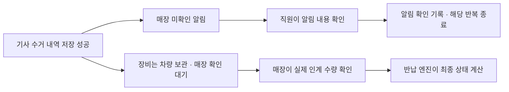

# 매장·차량 알림 기능 개발계획서

작성일: 2026-09-08 · 문서 버전: 1.0 · 기준 소스: `6f4f20c` · 상태: 개발 계획, 기능 구현 전

매장 POS와 차량 화면에 상단 알림함을 추가한다. 기사 수거, 업무 요청과 변경을 놓치지 않도록 미확인 개수와 종 흔들림을 표시하고, 이후 실제 기기 간 공유와 반복 알림음을 연결한다. 이 문서 작성 단계에서는 앱 소스·API·GitHub Pages를 변경하지 않는다.

관련 문서: [운영 보드](01-operations-board.md), [매장별 데이터·권한](04-multi-shop-architecture.md), [반납 기능 계약](10-return-functions.md), [현재 UI와 화면 크기](14-ui-v2-release.md).

## 1. 목표와 개발 범위

| 구분 | 내용 |
|---|---|
| 요청한 기능 | 매장·차량 상단 종 버튼, 알림 목록, 미확인 상태에서 반복되는 좌우 흔들림 |
| 요청한 후속 기능 | 확인 전까지 일정 간격으로 재생하는 알림음, 소리 설정 |
| 사용 방식 | 작은 버튼을 겨냥하지 않고 알림 행 전체를 눌러 내용을 확인 |
| 업무 원칙 | 알림 확인, 기사 수거, 매장 최종 반납 확인을 각각 구분 |
| 첫 화면 체험 | 같은 페이지의 매장·차량 화면 사이에서 알림 생성·확인 흐름 검증 |
| 실제 운영 연결 | 서버 저장, 담당 차량 구분, 다른 기기의 확인 상태 공유, 재접속 복구 |
| 별도 후속 범위 | 화면 잠금·백그라운드 시스템 푸시, 필요 시 안드로이드 앱 연동 |

반복 간격 30초, 흔들림 1초와 휴지 2초 등 아래 수치는 구현 기본값이다. 소리 반복 간격·볼륨은 설정에서 바꾸고, 흔들림 속도는 현장 시험 후 조정한다. 실제 기기에서 확인하지 않은 소리·백그라운드 동작을 지원 완료로 표시하지 않는다.

고객 문자·전화 자동 발송, 미수금 독촉, 자동 반납 완료는 이 알림 기능에 포함하지 않는다. 현재 고객 안내·사전 입력 화면에는 직원용 종과 내부 알림을 표시하지 않는다.

## 2. 현재 구현과 추가할 부분

| 현재 코드 | 확인한 상태 | 개발 시 처리 |
|---|---|---|
| [shell.html](../design/app/shell.html) | 매장 상단에 샘플 데이터·화면 전환·나가기만 있음 | 공통 종과 알림창 추가 |
| [rentals.js](../design/app/rentals.js) | `driver-alert`는 실제 전송 없이 안내창 표시 | 업무에 연결된 확인 요청 생성으로 교체 |
| [first-look.fragment.html](../design/prototypes/first-look.fragment.html) | 선택한 차량 업무에 우선 요청 배너와 `확인했어요` 표시 | 공통 알림 상태를 사용하고 전체 차량 알림함과 연결 |
| [returns.js](../design/app/returns.js) | `vehicleFlags`에 페이지 내부 확인 상태 저장. `R-021` 요청 강조는 샘플 조건 | 공통 알림 저장소로 이동. 샘플 요청은 명시적인 시드로 생성 |
| [returns.js](../design/app/returns.js) | 수거 성공 후 갱신하는 경로와 수량 정정·취소 경로가 있음 | 성공한 업무 이벤트를 알림으로 연결 |
| [domain.js](../src/returns/domain.js), [service.js](../src/returns/service.js) | 요청 ID, 업무 버전, 처리 이력, 중복 방지와 매장·차량 권한 존재 | 업무 이력을 재사용하되 알림 읽음 상태는 별도 관리 |
| [client.js](../src/returns/client.js) | 기본 3초 폴링. 변경된 접수의 최신 스냅샷을 조회 | 알림 전용 변경 조회·확인 동기화 추가 |
| [return-runtime.js](../design/app/return-runtime.js) | 메모리 모드. 새로고침 초기화, 기기 간 공유 없음 | Pages 체험과 운영 API 연결을 명시적으로 구분 |
| [operations.js](../design/app/operations.js) | 직원·기사·담당 차량은 체험용 명단. 실제 계정·업무 배정과 미연결 | 운영 연결 전에 인증 사용자와 차량 ID를 매핑 |
| [build.py](../scripts/build.py), [check.py](../scripts/check.py) | `srcdoc` iframe, `sandbox="allow-scripts"`, 외부 연결 차단. 화면 모듈의 직접 통신·저장도 검사 | 공개 체험의 제한 유지. 운영 연결용 진입점과 빌드·검사를 별도로 설계 |

현재 반환되는 접수 스냅샷만 비교하면 짧은 시간에 연속 발생한 요청·정정·확인을 놓칠 수 있다. 알림은 저장된 이벤트에서 생성하고 독립된 변경 기록으로 조회해야 한다.

## 3. 알림 종류와 발생 조건

다음은 목표 범위다. 아직 없는 업무 저장 기능은 선행 작업을 완료한 후 연결하며, 해당 기능이 이미 동작하는 것으로 표시하지 않는다.

| ID | 받는 곳 | 발생 조건과 표시 예시 | 누르면 | 반복 소리 | 현재 연결 기반 |
|---|---|---|---|---|---|
| N01 | 매장 | 기사 수거 저장 성공: `1호 차량 · 김영희 수거 내역 · 매장 확인 필요` | 해당 접수의 차량 인수분 확인 | 켬 | `collect` 이벤트·`collectionId` 있음 |
| N02 | 매장 | 일부 수거·미수거: `스키 2개 수거 · 의류 1개 남음` | 받은 수량·잔여 수량 | 켬 | 실제 수량·잔여 수량 계약 있음 |
| N03 | 매장 | 기사 도움 요청·수량 이상 보고 | 요청 내용과 해당 업무 | 켬 | 요청 작성·저장 기능 추가 필요 |
| N04 | 담당 차량 | 새 배달·수거 업무 배정 | 배정된 업무 | 켬 | 영구 업무 ID·배정 이벤트 추가 필요 |
| N05 | 담당 차량 | 예정 날짜·시간·장소·수량 변경 | 변경 전후 내용과 최신 업무 | 켬 | `planReturn` 일부 활용. 배달·배정 데이터 연결 추가 필요 |
| N06 | 담당 차량 | 업무 취소·담당 차량 변경 | 취소/변경 안내 | 켬 | 취소·배정 변경 이벤트 추가 필요 |
| N07 | 담당 차량 | 매장 직원의 우선 확인 요청 | 요청 내용과 해당 업무 | 켬 | 현재 안내창을 요청 저장으로 교체 |
| N08 | 매장 | 기사님이 N07을 확인함 | 원래 요청의 확인자·시각 | 끔 | 확인 응답 추가 필요. 새 미확인 알림을 만들지 않고 원래 요청 갱신 |
| N09 | 반대 업무 담당 | 수거 수량 정정·기록 취소·매장 인계 결과 | 해당 기록의 변경 내용 | 재확인이 필요하면 켬 | `correctReturn`, `undoReturn`, `confirmVehicle` 있음 |

- N01과 N02는 한 번의 수거 저장에 대해 하나의 알림으로 생성한다. 일부 수거면 받은 품목과 남은 품목을 함께 표시한다.
- 실제 수거량이 0이면 `수거 완료`라고 쓰지 않는다. `수거하지 못함 · 남은 품목 확인 필요`로 표시한다.
- 매장이 대신 입력한 기록을 `기사님이 처리함`이라고 표시하지 않는다. 이벤트의 실제 처리자를 사용한다.
- 같은 요청 ID의 재전송, 저장 실패, 단순 화면 갱신은 새 알림을 만들지 않는다.
- 알림에 접수번호, 업무 종류, 차량, 장소, 예정 시각, 발생 시각을 담아 같은 이름의 고객도 구분한다. 차량에는 요금·미수금·직원 개인번호를 포함하지 않는다.
- 일정 취소 시 기존 일정 요청은 종료하고, 별도의 취소 안내를 만든다. 업무를 없애는 것만으로 기사님이 취소를 확인했다고 처리하지 않는다.
- 타임 기준이나 연락처 설정 변경만으로 이미 저장된 업무 변경 알림을 발송하지 않는다. 실제 해당 업무가 변경된 경우에만 생성한다.

## 4. 화면과 터치 동작

### 상단 종과 알림창

- 매장: 상단 오른쪽 화면 전환 버튼 옆에 종을 배치한다. 기존 헤더 높이와 접수 도구 영역을 유지한다.
- 차량: 보라색 헤더에 같은 종을 배치한다. 간단/자세한 모드, 매장 화면, 나가기와 겹치지 않도록 헤더를 다시 배치한다. 현재 절대 위치와 고정 오른쪽 여백에 버튼만 추가하지 않는다.
- 종 터치 영역은 POS 48×48px 이상, 차량 56×56px 이상을 목표로 한다. 차량 수거 등 기존 주요 작업 버튼 72px 이상은 유지한다.
- 미확인 개수를 숫자로 표시하고 접근성 이름에도 포함한다. 미확인이 없으면 숫자 배지와 흔들림을 해제한다.
- 종을 누르면 오른쪽 알림창을 현재 화면 위에 연다. 낮은 화면에서는 가용 높이에 맞추고, 제목·탭·닫기를 고정한다. 긴 목록만 알림창 안에서 스크롤한다.
- `미확인 / 전체` 탭을 제공한다. 미확인은 우선 확인 요청을 먼저, 같은 중요도에서는 최근 항목부터 표시한다. 알림창을 열고 조작하는 동안 새 항목 때문에 누르려던 행이 이동하지 않도록 새 알림 안내를 둔다.
- 각 행은 전체가 하나의 터치 대상이다. POS 64px, 차량 72px 이상을 기본으로 하고 긴 내용은 잘라 숨기지 않고 행 높이를 늘린다. 행 안에 작은 중첩 버튼을 만들지 않는다.
- 알림 도착만으로 현재 고객, 선택한 차량 업무, 입력창, 화면 모드를 자동 변경하지 않는다.
- 알림창을 닫으면 종으로 포커스를 돌린다. 키보드 Tab·Enter·Space·Escape와 화면 읽기 도구의 새 알림 안내도 지원한다.

### 확인 기준과 업무 이동

1. 종을 누르는 것은 목록 열기다. 목록을 열거나 스크롤하는 것만으로 확인 처리하지 않는다.
2. 알림 행 전체를 눌러 내용이 정상적으로 열리면 해당 알림만 확인한다. 필요하면 상세 안의 큰 `업무 열기` 행으로 원래 업무를 연다.
3. 차량의 기존 요청 배너도 같은 알림을 참조한다. `확인했어요` 영역을 포함한 요청 띠 전체를 터치할 수 있게 하고 중첩 버튼은 피한다.
4. 운영 모드에서는 서버의 확인 저장 응답을 받은 후 개수·흔들림·반복 소리에서 제외한다. 실패하면 `확인 저장 실패 · 다시 시도`를 표시한다.
5. 다른 미확인이 있으면 종 흔들림은 계속된다. 확인한 내역은 전체 탭에 남긴다.
6. 작성 중인 접수와 수량·시간 설정 값을 보존한다. 알림창이 기존 공통 대화상자 내용을 덮어쓰지 않게 하고, 업무 이동 후 돌아와도 입력이 유지되는지 검증한다.

차량의 요청 배너와 종은 별도 읽음 값을 갖지 않는다. 어떤 경로에서 확인해도 같은 상태를 반영한다. 고객·접수가 삭제되거나 접근 권한이 없어 내용을 열 수 없으면 최신 상태를 다시 받고, 다른 고객 업무로 임의 이동하지 않는다.

### 종 흔들림

- 미확인인 유효 알림이 한 건 이상이면 좌우 약 ±10도로 1초간 흔들고 2초 쉬는 동작을 반복한다.
- 버튼·배지·주변 글자의 위치는 고정하고 종 아이콘만 움직인다. 알림이 늘어도 애니메이션을 중첩하지 않는다.
- 운영체제의 움직임 줄이기 설정에서는 정적인 강조와 숫자로 대체한다. 소리 끄기는 미확인 표시를 없애지 않는다.
- 알림 확인, 업무 취소로 요청 종료, 로그아웃 또는 다른 수신 범위로 전환하면 해당 흔들림을 정리한다.

## 5. 알림 상태와 업무 상태

| 관리 대상 | 상태와 의미 |
|---|---|
| 요청 전달 | `서버 접수` → `기기 수신` → `사람이 확인`. 서버 접수만으로 기기 수신을 표시하지 않음 |
| 알림 확인 | `미확인` → `확인함`. 첫 확인자와 서버 시각 기록 |
| 알림 유효성 | `active`, `resolved`, `cancelled`, `superseded`, 필요한 경우 `expired` |
| 장비 업무 | 기존 지급·고객 보유·차량 보관·매장 확인 상태와 수량 계약 유지 |

- 종 개수는 수신 권한이 있는 `active` 미확인 알림 수다. 반복 소리는 그중 재확인이 필요한 알림에만 적용한다.
- 업무가 처리되어 요청이 더 이상 필요 없으면 `resolved`로 바꾼다. 사람이 읽은 것처럼 확인 시각을 만들어 넣지 않고 `업무 처리로 종료`라고 표시한다.
- 예정 시각이 지났다는 이유만으로 유효한 요청을 자동 삭제하거나 확인 처리하지 않는다. 유효시간이 별도로 있는 요청만 만료 정책을 적용한다.
- 수량 정정으로 다시 확인할 일이 생기면 새로운 이벤트에 따른 알림을 만든다. 이전 확인 상태로 새 알림을 숨기지 않는다.
- 알림 확인 명령은 반납 수량, 접수의 업무 버전, 결제·미수금·할인·재고를 변경하지 않는다.
- 매장 알림은 공유 확인 방식으로 한다. 직원 한 명이 확인하면 같은 매장의 다른 POS에도 확인자·시각을 반영한다. 차량 알림은 해당 차량의 인증된 담당자끼리 공유한다.
- `기사님 확인함`은 원래 요청의 상태 갱신이다. 확인 응답에 다시 확인 응답을 생성하는 순환을 만들지 않는다.

## 6. 데이터·API 설계

### 저장 구조

아래 이름은 신규 구현의 권고안이며 현재 존재하는 테이블·API가 아니다.

| 데이터 | 주요 필드·키 | 규칙 |
|---|---|---|
| 알림 | `id`, `shopId`, `type`, `attentionRequired`, `sourceEventId`, `orderId`, 선택 `taskId`·`collectionId`, `createdAt` | 저장된 업무 이벤트 또는 명시적 요청에서 생성 |
| 수신·확인 | `notificationId`, `recipientKind`, 선택 `vehicleId`, `lifecycle`, `acknowledgedAt`, `acknowledgedBy`, `revision` | 매장 공용 또는 특정 차량 공용. 확인은 첫 성공 기록을 유지 |
| 표시 내용 | 제목, 요약, 변경 전후 값, 허용된 화면 경로와 업무 ID | 발생 당시 내용과 최신 유효 상태를 구분. 임의 URL로 이동하지 않음 |
| 기기 수신 | `notificationId`, 인증된 기기 세션, 서버 수신 확인 시각 | 사람 확인과 구분. 클라이언트가 알림 데이터를 받은 후 보고 |
| 변경 기록 | 생성·확인·종료·권한 회수, 알림 전용 순번 | 재접속 시 확인·종료·삭제도 누락 없이 동기화 |
| 기기 설정 | 소리 사용, 반복 간격, 볼륨, 움직임 설정, 마지막 재생 상태 | Pages는 메모리. 운영은 인증된 기기 범위에 저장 |

중복 생성 방지 키는 `매장 + 원본 이벤트 ID + 알림 종류 + 수신 범위`로 한다. 사용자가 누르는 요청·확인에는 별도 `requestId`를 부여한다. 동일 ID·동일 내용 재시도는 같은 결과를 반환하고, 같은 ID의 다른 내용은 거절한다. 이미 미확인인 동일 업무·동일 내용의 요청을 연타해도 행을 늘리지 않는다.

반납 이벤트의 원본 ID는 `orderId + event.requestId`로 식별한다. 현재 요청 ID의 중복 제한은 접수 단위이므로, 요청 ID만 사용해 서로 다른 접수의 알림을 합치지 않는다. 직접 생성하는 확인 요청은 서버가 고유 ID를 발급한다.

현재 차량 카드 ID에는 예정 날짜·시간·장소가 들어간다. 이 문자열은 일정 변경 시 달라지므로 영구 알림의 식별자로 사용하지 않는다. 접수·수거 기록 ID를 먼저 활용하고, 배달·수거 배정 기능에는 수정 후에도 유지되는 `taskId`와 업무 버전을 도입한다.

### 업무 저장과 알림 생성

1. 업무 명령의 권한·수량·버전을 검증한다.
2. 업무 변경, 원본 이벤트와 알림 기록을 같은 저장 트랜잭션에서 기록한다. 알림 기록에 실패하면 해당 트랜잭션도 롤백한다.
3. 업무 응답은 기존 계약을 유지한다. 별도 푸시 전송 실패를 이미 저장된 업무의 실패처럼 표시하지 않는다.
4. 시스템 푸시를 연결하는 단계에서는 전송 대기 기록도 같은 트랜잭션에 남기고 커밋 이후 전송한다. 재시도는 같은 알림 ID를 사용한다.

기존 [SQLite 저장소](../server/returns-repository.cjs)의 트랜잭션을 확장한다. 화면에서 `execute()` 성공 후 별도의 알림 생성 HTTP 요청을 보내는 방식은 두 요청 사이의 종료·연결 끊김 때문에 알림이 누락될 수 있어 운영 저장 경로로 사용하지 않는다.

DB 구조 변경 시 기존 접수·이벤트를 보존하는 버전 마이그레이션과 재시작 검증을 포함한다. 현재 코드는 DB 버전 1보다 큰 값을 거절하므로, 운영 복구는 새 DB에 구버전 앱만 덮어쓰는 방식으로 계획하지 않는다.

### 신규 API와 클라이언트 계약

| HTTP | 제안 경로 | 계약 |
|---|---|---|
| GET | `/api/notifications` | 권한 범위의 미확인·전체 목록, 다음 페이지 커서, 전체 미확인 개수 |
| GET | `/api/notifications/sync?cursor=...` | 생성·확인·종료·제거 변경과 다음 커서. 반납 `revision`과 구분 |
| POST | `/api/notifications/requests` | 업무 ID, 요청 종류·내용, 기대 업무 버전, 요청 ID로 요청 생성 |
| POST | `/api/notifications/:id/received` | 해당 기기 세션의 수신 보고. 사람 확인으로 처리하지 않음 |
| POST | `/api/notifications/:id/ack` | 해당 알림 확인. 중복 확인은 같은 결과, 첫 확인자 보존 |
| GET / POST | `/api/notifications/preferences` | 인증된 현재 기기의 알림 설정 조회·저장 |

- `shopId`, 처리자와 시각은 인증 문맥·서버에서 결정한다. 다른 매장이나 차량 ID를 본문에 넣어 수신 범위를 바꿀 수 없다.
- 신규 배정·일정 변경·취소는 해당 업무 API의 성공 이벤트에서 발생시킨다. 알림 요청 API를 이용해 실제 업무가 바뀐 것처럼 알림만 만드는 것은 허용하지 않는다.
- 첫 연결은 현재 유효한 미확인 목록과 커서를 함께 받는다. 전날의 유효한 미확인도 포함한다. 이후 약 3초 간격으로 변경분을 가져오며 이 간격은 실시간 전달 보장 시간이 아니다.
- 페이지가 나뉜 변경 조회는 전달한 지점까지만 커서를 전진시킨다. 만료된 커서는 전체 상태를 다시 받아 복구한다.
- 차량 배정·권한이 바뀌면 이전 기기에도 제거/접근 해제 상태를 반영하고 오래된 알림의 반복을 중단한다. 새 담당 차량에는 별도 배정 알림을 생성한다.
- 메뉴 이동으로 폴링을 중복 등록하지 않는다. 로그아웃·매장/차량 변경에서는 구독·알림 메모리·소리를 정리하고 새 인증 범위로 연결한다.
- 연결이 끊기면 `연결 끊김 · 마지막 확인 시각`을 표시한다. 확인 저장 실패는 같은 요청 ID로 명시적으로 재시도한다. 연결 복구 시 현재 유효 상태를 다시 받은 후 소리를 재개한다.

초기 운영 연결은 기존 HTTP·직원 토큰 인증을 활용할 수 있다. 다만 현재 임시 로그인과 직원 명단은 이 인증에 연결되어 있지 않다. 계정 발급·회수, 직원 소속·역할, 실제 담당 차량을 연결하는 작업을 운영 배포의 선행 조건으로 둔다.

## 7. 소리와 백그라운드 처리

### 화면을 보고 있는 동안의 소리

| 항목 | 기본 동작 |
|---|---|
| 시작 | 사용자가 `알림 소리 켜기`를 누르면 시험 재생하고 실제 재생 가능 여부 확인 |
| 최초 알림 | 유효한 중요 알림을 받으면 짧은 소리 1회 |
| 반복 | 확인이 필요한 알림이 남으면 30초 간격. 설정에서 60초 선택 가능 |
| 여러 알림 | 동시에 한 번만 재생. 알림별 타이머·소리를 중첩하지 않음 |
| 설정 | 켜기/끄기, 30초/60초, 볼륨, 소리 테스트. 매장·차량 기기별 적용 |
| 중지 | 확인 완료, 요청 종료, 로그아웃, 수신 범위 변경, 사용자가 소리 끄기 |
| 재접속 | 오래된 알림음을 한꺼번에 재생하지 않음. 현재 유효 알림 기준으로 한 번 안내 |

한 기기에 같은 화면을 여러 탭으로 열어도 소리가 겹치지 않도록 재생 담당 탭을 하나로 정한다. Pages의 한 페이지 체험에는 기기 간 재생 조정을 구현한 것으로 표시하지 않는다.

브라우저가 소리를 차단하거나 오디오가 중단되면 `소리 꺼짐/재생 확인 필요` 상태와 다시 켜기 동작을 보여준다. 설정값이 켜져 있다는 이유로 소리가 실제로 나왔다고 표시하지 않는다. 앱 볼륨 설정과 태블릿의 시스템 음량도 구분한다.

[Chrome 자동 재생 정책](https://developer.chrome.com/blog/autoplay/)에 따라 사용자 동작에서 오디오를 시작·재개하고 재생 실패를 처리한다. 현재 Pages의 iframe에서도 이 동작을 별도로 시험한다. 데모 소리를 위해 외부 통신이나 저장 제한을 일괄 해제하지 않는다.

### 화면 잠금·다른 앱 사용

백그라운드에서는 브라우저의 타이머 실행이 늦어지거나 페이지 실행이 멈출 수 있다. 따라서 웹/PWA의 화면 내부 타이머를 화면 잠금 상태에서도 30초마다 울리는 알람으로 약속하지 않는다. [Chrome 타이머 제한](https://developer.chrome.com/blog/timer-throttling-in-chrome-88/) · [페이지 실행 중단 정책](https://developer.chrome.com/docs/web-platform/page-lifecycle-api).

시스템 알림은 HTTPS 운영 화면, 알림 권한, 서비스 워커와 푸시 구독·전송을 별도 단계에서 연결한다. 모바일은 서비스 워커의 알림 표시 방식을 사용한다. 현재 공개 체험의 `srcdoc` iframe을 그대로 시스템 푸시 진입점으로 사용하지 않는다. [모바일 알림 구현과 권한](https://developer.mozilla.org/en-US/docs/Web/API/Notifications_API/Using_the_Notifications_API).

시스템 알림을 닫는 동작은 업무 알림 확인으로 간주하지 않는다. 알림을 눌러 앱에서 내용을 확인했을 때 공통 확인 API와 연결한다. 잠금 화면 문구는 `매장에서 확인 요청이 도착했습니다`처럼 최소 정보로 표시한다. 푸시 도입 자체가 일정 간격의 소리 재생을 보장하는 것은 아니며 실제 탭 S6에서 검증한다.

## 8. 단계별 작업과 커밋 단위

큰 기능 범위로 나누되 다음 단계는 앞 단계의 완료 기준을 통과한 후 진행한다. 아래는 계획이며 현재 구현·검증을 마쳤다는 뜻이 아니다.

| 단계 | 작업 범위 | 완료 기준 | 제안 커밋 |
|---|---|---|---|
| 1. 공통 알림 화면 | 메모리 알림 모델, 상단 종·개수·흔들림, 목록·행 전체 터치, 샘플 요청·수거·확인 연결 | 같은 페이지의 매장↔차량 전환에서 상태 일치. 반납·접수 흐름 보존. 좁은 화면 통과 | `feat(notifications): add shared POS and vehicle inbox` |
| 2. 알림 저장·동기화 | 공통 도메인·SQLite 마이그레이션, 업무와 알림의 원자적 저장, 요청·수신·확인 API, 별도 커서·권한 | 별도 두 브라우저 클라이언트에서 수거·우선 요청 공유. 서버 재시작·중복·권한 검사 통과 | `feat(notifications): persist requests and acknowledgements` |
| 3. 운영 업무 연결 | 직원 인증·담당 차량 연결, 안정적인 업무 ID, 실제 배정·변경·취소·기사 요청의 저장 경로, 운영 화면 진입점 | N01~N09 전체를 실제 저장 이벤트로 연결. 선행 기능이 남으면 해당 단계도 미완료로 기록 | `feat(notifications): connect dispatch events and recipients` |
| 4. 반복 소리 | 소리 활성화·시험, 반복·볼륨 설정, 단일 재생, 재접속·확인 연동 | 활성 화면에서 재생·반복·중지가 설정대로 동작. 차단·음소거 상태를 정확히 표시 | `feat(notifications): add sound controls and reminders` |
| 5. 현장·백그라운드 | 탭 S6 실기기 시험, 운영 PWA 진입점과 시스템 푸시, 필요 시 앱 방식 검토 | 화면 켬/잠금/앱 전환별 결과 기록. 검증된 지원 범위만 공개 | `feat(notifications): add operational push delivery` |

1단계 완료 후 GitHub Pages에서 UI 체험이 가능하다. 2~3단계의 로컬 통합 시험과 별개로 실제 운영에는 API 호스팅·HTTPS·인증 연결이 필요하다. 공개 체험에는 가상 자료를 유지하고, 운영 연결용 빌드는 명시적인 서버 주소와 인증 경계를 사용한다. 4단계 소리도 먼저 체험할 수 있지만 기기 간 전달 완료를 뜻하지 않는다.

5단계에서 네이티브 앱 개발을 결정하는 경우 앱별 알림·백그라운드 요구사항을 별도 계획으로 확정한다. 현장 검증 작업은 실제 변경이 없으면 테스트·문서 커밋으로 남기며 푸시가 구현된 것처럼 커밋명을 쓰지 않는다.

## 9. 변경 대상 파일

| 구분 | 위치 | 역할 |
|---|---|---|
| 신규 공통 모듈 | `src/notifications/domain.js`, `service.js`, `client.js` | 상태·수신 범위·중복 방지, 메모리/HTTP 계약 |
| 신규 화면 모듈 | `design/app/notifications.js`, `notifications.css` | 상단 종, 목록·상세, 흔들림, 기기 설정·소리 제어 |
| 기존 화면 연결 | `design/app/shell.html`, `core.js`, `rentals.js`, `returns.js`, `settings.js`, `operations.js` | 헤더·라우팅·요청·반납·설정 연결. 직접 HTTP 호출은 공통 클라이언트로 분리 |
| 차량 연결 | `design/prototypes/first-look.fragment.html`, `design/app/polish.css`, `responsive.css` | 기존 요청 배너·확인과 낮은 높이의 헤더 배치 |
| 서버 저장 | `server/returns-repository.cjs`, 신규 알림 저장 어댑터 | 같은 DB 트랜잭션에서 이벤트·알림 기록, 마이그레이션 |
| 서버 서비스 | `server/returns-api.cjs`, `src/returns/service.js`와 신규 알림 서비스 | 인증 재사용, API 라우팅, 성공한 업무 이벤트 연결 |
| 빌드·검사 | `scripts/build.py`, `scripts/check.py`, `package.json` | 신규 모듈 포함, 체험/운영 검사 구분. `dist/` 직접 수정 금지 |
| 신규 자동 검증 | `tests/notifications-*.test.cjs`, `scripts/smoke-notifications.cjs` | 도메인·저장·API·클라이언트·화면 통합 검증 |

`src/returns/domain.js`의 기존 수량 규칙에 화면 알림이나 오디오를 넣지 않는다. 업무 배정 저장 모듈의 세부 파일 구조는 3단계에서 확정하되, 안정적인 ID·권한·성공 이벤트 계약은 먼저 맞춘다.

## 10. 검증 시나리오와 완료 기준

### 기능·저장·통신

| ID | 시나리오 | 통과 기준 |
|---|---|---|
| A01 | 다른 고객 업무를 보고 있는 차량에 우선 요청 도착 | 현재 화면 유지, 종·개수 갱신, 알림함에서 해당 요청 접근 |
| A02 | 알림 3개 중 목록만 열기, 이후 1개 내용 열기 | 목록만 열면 3개 유지, 개별 확인 성공 후 2개, 흔들림 유지 |
| A03 | 마지막 알림을 목록 또는 요청 배너에서 확인 | 양쪽 표시 일치, 해당 반복 소리와 흔들림 종료 |
| A04 | 기사 일부 수거 후 매장이 알림 확인 | 실제 수거·잔여 수량 표시, 고객 보유·차량 보관·매장 확인 수량은 읽음으로 변경되지 않음 |
| A05 | 수거량 0, 수량 정정, 기록 취소 | 허위 완료 없음, 기존 알림 종료·변경과 새로운 확인 필요 상태 일치 |
| A06 | 매장 POS 두 대에서 동시에 확인 | 한 확인 결과로 수렴, 첫 확인자·시각 보존, 접수 업무 버전 불변 |
| A07 | 요청·수거·확인 응답 유실 후 같은 ID 재시도 | 중복 알림·중복 업무 없음. 알림만 누락되거나 업무만 저장되지 않음 |
| A08 | DB 알림 기록 실패·서버 재시작 | 원자적 롤백, 이미 저장된 알림·확인 상태는 재시작 후 유지 |
| A09 | 1호·2호 차량 및 다른 매장으로 조회·확인 시도 | 권한 밖 내용·개수·확인 조작 차단 |
| A10 | 오프라인 중 업무 취소·배정 변경 후 복귀 | 최신 종료·제거 상태 반영, 오래된 요청 소리 재생 없음, 새 담당에게만 새 배정 |
| A11 | 폴링 사이 연속 변경·목록 페이지 초과·오래된 커서 | 생성·확인·종료 변경 누락 없음, 필요 시 전체 상태 복구 |
| A12 | 접수·기간·수량·시간 설정 중 알림 도착·열기·닫기 | 작성 값과 기존 대화상자 보존, 자동 화면 이동 없음, 포커스 복귀 |
| A13 | 소리 차단·끄기·설정 변경·여러 탭·연속 알림 | 겹친 재생 없음, 실제 재생 상태 표시, 개수와 확인 기능 유지 |
| A14 | Pages 새로고침·공개 고객 화면 진입 | 체험 데이터만 초기화, 외부 변경 요청 없음, 공개 고객 화면에 직원 알림·내부 업무 정보 노출 없음 |

### 화면 크기와 실제 기기

| 화면 | 기준 | 확인 항목 |
|---|---|---|
| PC·POS | 1024×768, 1366×768 | 상단 종·접수 도구 겹침 없음, 행 전체 터치, 알림창 닫기·탭 고정 |
| 낮고 좁은 POS 창 | 907×648, 907×710 | 기존 오늘 할 일·차량 다음 일정·접수 상품 영역의 불필요한 스크롤 재발 없음 |
| 차량 가로 화면 | 1024×520, 1024×600, 1024×800 | 간단/자세한 모드와 종 겹침 없음, 장소·시간·수량·주요 버튼 유지 |
| 고객 모바일 회귀 | 360px, 390px 폭 | 직원 알림 미노출, 기존 입력·안내 흐름 유지 |
| 실제 탭 S6 | 브라우저 탭·주소창·작업 표시줄이 있는 상태 | 실제 터치 크기·시스템 음량·알림 소리, 전화/다른 앱 후 복귀 확인 |
| 실제 탭 S6 후속 | 설치형 웹앱, 화면 잠금, 배터리 절약, 네트워크 전환 | 수신·소리·동기화 결과를 조건별 기록. 화면 켬 결과와 구분 |

1024×520은 사진을 고려한 보수적인 CSS 뷰포트이며 탭 S6의 실측 해상도라고 쓰지 않는다. POS 해상도 규칙을 차량·고객 화면에 일괄 적용하지 않는다.

새 알림 검증 명령 `test:notifications`, `test:notifications:ui`는 구현 단계에서 추가한다. 변경 범위에 따라 기존 `check`, `test:returns`, `test:returns:ui`, `test:intake`, `test:time-picker`, `test:operations`, `test:visual`과 기본 클릭 흐름도 실행한다. 소리는 자동 재생 호출 검사와 실제 기기에서 들리는지 확인한 결과를 구분한다. 이 계획서 작성 과정에서 위 기능 검증을 수행한 것으로 기록하지 않는다.

## 11. 배포·완료 보고

- 단계별 커밋에는 실제 완료 범위와 통과한 검사를 적는다. 구현되지 않은 이벤트나 미실시한 실기기 시험을 따로 남긴다.
- UI 체험 배포는 빌드·해당 회귀 검사를 통과한 커밋으로 수행한다. GitHub Actions 성공, 공개 페이지의 빌드 일치, 실제 알림 열기·확인 흐름까지 확인한다.
- 운영 연결 완료는 서로 다른 두 기기에서 요청·수거·확인이 공유되고, 서버 재시작 뒤에도 남는 것으로 판정한다. 같은 페이지에서 매장/차량만 전환한 결과로 대체하지 않는다.
- 실제 운영 배포 시 데이터 마이그레이션·복구 방법과 인증·담당 차량 연결을 함께 검증한다. 알림 실패로 기존 수거·매장 확인 수량을 임의로 바꾸지 않는다.
- 최종 보고에는 적용 커밋, 확인 가능한 주소, 지원하는 알림 종류, 자동 검사 결과, 실제 탭 S6 결과, 백그라운드 지원 범위를 기재한다.

이 문서는 사용자 요청과 2026-09-08 코드 확인에 근거한 개발 계획이다. 브라우저 제약은 위 공식 문서를 참고했으며, 구현 시 대상 브라우저와 실제 기기에서 다시 검증한다.
