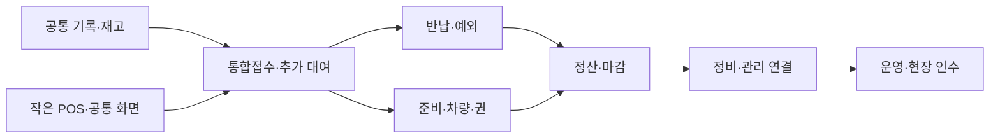

# 스키노트 POS 업무 개선 개발계획서

작성일: 2026-09-13 · 버전: 1.0 · 분석 기준 소스: `a4f8128`

이 문서는 현재 시스템 분석에 대한 사용자 동의와 추가 요구를 반영한 개발 기준이다. 이번 산출물은 개발계획서와 GitHub 마일스톤이며, 구현 착수·운영 배포 완료를 의미하지 않는다. 마일스톤 링크와 진행 상태는 [개발 마일스톤](31-pos-workflow-milestones.md)에서 관리한다.

## 1. 목표와 최종 요구사항

**처음 쓰는 직원도 메뉴 이름으로 처리 위치를 예상하고, 같은 고객의 접수·추가 대여·준비·지급·반납·정산을 이어서 마칠 수 있는 POS를 만든다.**

| 요구 ID | 최종 요구사항 | 완료 판단 |
|---|---|---|
| R01 | 하나의 통합접수번호로 한 팀의 이번 방문 업무를 연결 | 접수·사전입력·리프트권·지급·차량·반납·금전 기록에서 같은 접수와 고객을 추적 |
| R02 | 이미 대여 중인 팀에 당일·다음날 도착한 일행과 장비를 추가 | 기존 기록을 유지하고 추가 인원/품목의 이용일·요금·지급·반납을 별도로 처리 |
| R03 | 기존 일행에게도 장비·의류·리프트권을 추가 | 이미 지급한 사람이라는 이유로 추가 지급을 차단하지 않음 |
| R04 | 작은 포스에서도 핵심 정보와 처리 버튼은 스크롤 없이 표시 | 실제 앱 표시 영역 1024×768 및 1024×600에서 핵심 영역의 가로·세로 스크롤과 잘림 없음 |
| R05 | 새 입력과 타이핑 최소화 | 기존 고객·일행·날짜·장소·품목 정보를 재사용하고 정상 반납에는 필수 타이핑 없음 |
| R06 | 기능 위치와 다음 행동을 예측 가능하게 구성 | 업무 순서 메뉴, 같은 이름의 행동, 고객을 유지하는 다음 버튼, 문맥별 문제 해결 |
| R07 | 정상 흐름과 예외 흐름을 같은 기록에서 마무리 | 부분반납·조기수거·분할지급·교환·취소·정정·파손·분실·미수의 후속 업무가 남음 |
| R08 | 화면마다 같은 수량·일정·잔액을 사용 | 공통 업무 기록에서 계산하며, 처리 진입 화면에 따라 결과가 달라지지 않음 |
| R09 | 운영 전환 시 저장·동기화·권한·복구를 검증 | 새로고침/재시작/다른 기기에서도 이어지고, 중복·동시 요청에 수량과 금액이 보존됨 |

‘768’은 기존 프로젝트의 포스 기준인 **1024×768의 높이**로 해석한다. 정확한 기종·배율은 아직 미확정이다. 숫자는 모니터 해상도만이 아니라 **브라우저/PWA 안의 실제 앱 표시 영역(CSS px)**으로 검증한다. 주소창·작업표시줄을 고려해 **1024×600도 핵심 무스크롤 필수 기준**으로 둔다. 768px 폭은 별도 보조 반응형 검사로 포함하고 실기기 확정 시 지원 기준을 갱신한다.

## 2. 현재 상태와 개선 범위

### 현재 활용할 기반

- 실제 지급, 고객 보유, 차량 보관, 매장 반납 확인 수량을 구분한다.
- 장비와 리프트권의 준비·전달·회수를 독립 추적한다.
- 직접반납·부분반납·조기반납·교환의 일부 처리, 중복 요청 방지, 버전 충돌 검증이 구현돼 있다.
- API 클라이언트·SQLite 저장소·매장/차량 권한 경로가 존재한다.
- 접수 초안·검색·선택 탭을 유지하는 메뉴 전환, 고객 입력폼, 준비표·팀 스티커, 알림 기능을 재사용한다.

현재 화면은 메모리 체험판이다. 저장소 밖의 화면용 접수 자료와 연결 정보가 있으며, 수납·환불·기간 연장·거래처 처리·실제 마감·재고정비에는 시안이 남아 있다. 운영 API 연결을 마지막에 단순 교체하는 방식으로 계획하지 않는다. **M1부터 영속 데이터와 공통 서비스 계약을 만들고, 각 기능을 메모리·SQLite 양쪽에서 검증한다.**

### 우선 해결할 확인된 문제

| 문제 | 현재 검증 수준 | 개발 단계 |
|---|---|---|
| 2호 차량 수거분의 상세 입고 확인은 실패하고 배달·수거의 내리기는 성공 | 로컬 브라우저 실제 버튼 재현 | M1 원인 수정, M4/M5 양쪽 화면 회귀 |
| 사전입력 지급이 다른 고객 배달에 배정된 재고를 사용할 수 있음 | 메모리 도메인 재현 + UI 선택 경로 확인 | M1 공통 재고 검증 |
| 일행 일부 적재 후 나머지 추가 적재 및 적재 후 취소/정정이 막힘 | 도메인 재현 + UI 차단 조건 확인 | M3 지급 단위 모델, M5 배달/복구 연결 |
| 교환 적재·전달·회수 후 전용 정정 경로가 없음 | 도메인·UI 소스 확인 | M4/M5 단계별 복구 |
| 오늘 할 일·재고·마감에 서로 다른 샘플/고정값 사용 | 소스·화면 확인 | M1 조회 계약, M3/M6/M7 연결 |
| 작은 화면에서 반납표 옆으로 스크롤, 예외 버튼 아래에 숨음 | 1024×768/1366×768 화면 확인 | M2 공통 화면, 모든 후속 마일스톤 |

직전 분석에서 기본 검사 94개, 메뉴 이동 6개, 렌탈·반납 13개가 통과했다. 이 수치는 당시 기준선이며 새 기능의 완료 증거로 재사용하지 않는다.

## 3. 통합접수와 늦게 합류한 일행

### 직원에게 보여 주는 구조

한 팀의 **이번 방문**에 통합접수번호 하나를 부여한다. 같은 대표자라도 다음 시즌의 다른 방문은 새 접수로 만든다. 이름이나 전화번호가 같다는 이유만으로 방문을 자동 합치지 않는다.

상세 상단에 대표자·연락처·접수번호와 함께 **`일행·장비 추가`**를 항상 찾을 수 있게 둔다. `접수·예약`, `이용 중·변경`, 공통 고객 검색에서 같은 동작을 연다.

추가 창의 첫 선택은 다음 세 가지다.

1. **새 일행 도착**: 기존 팀에 새 인원 또는 이름 미등록 일행을 추가한다.
2. **기존 일행 장비 추가**: 이미 이용 중인 사람에게 의류·장비·리프트권을 추가한다.
3. **추가 예정 등록**: 당일 나중/내일 도착분을 먼저 기록하고 실제 지급 전까지 대기 상태로 둔다.

기본 흐름은 `기존 팀 확인 → 추가 대상·품목 → 이용일/수령·반납 확인 → 추가 금액 확인 → 추가 저장`이다. 대표자 이름·연락처를 다시 입력하지 않는다. 저장 뒤 `바로 지급 / 준비하기 / 입력폼 보내기` 중 상황에 맞는 다음 행동을 제시한다.

### 같은 접수 안에서 보존할 구분

| 기록 | 필요한 정보와 규칙 |
|---|---|
| 고객 | 재방문 검색에 사용하는 고객 식별자. 연락처 변경 가능, 접수와 구분 |
| 통합접수 | 매장, 대표자, 이번 팀/방문, 생성 시각, 담당 직원 |
| 일행 | 자동 생성한 안정적인 인원 ID, 이름/별칭은 선택. 대표자 외 모든 사람의 전화번호를 요구하지 않음 |
| 추가 내역 | 첫 접수/오늘 추가/내일 추가를 식별하는 ID와 순서, 등록자·등록일, 대상 일행, 취소 여부 |
| 품목 행 | 고유 `lineId`와 별도 `skuId`, 대상 인원 또는 인원 미지정 묶음, 실제 물품 수량, 이용일별 청구 수량 |
| 이용·수령·반납 | 행 또는 같은 조건 묶음별 이용 시작/종료, 실제 수령 예정, 반납 일시·방법·장소·차량 |
| 가격 | 확정 당시 단가·요금표 버전·기간·할인·추가 금액. 추가 내역별로 보존 |
| 준비·지급 | 한 사람당 1회로 제한하지 않는 준비/지급 ID. 차수·품목·실물·실제 전달 시각과 수량 |
| 물품 이동 | 실제 물품 ID와 위치, 상태, 이동 이력. 날짜별 청구 수량을 물리 재고로 합산하지 않음 |
| 금전 | 수납·환불·보증금·가격 조정 및 해당 접수/추가 내역에 배분한 기록 |
| 문서·입력폼 | 같은 접수와 추가 대상 연결, 제출/확정/출력 버전, 인쇄 후 변경 여부 |

위 필드명은 개발 계약의 제안이며 기존 필드를 안전하게 이관해 확정한다. 내부의 차수·배정 ID를 직원에게 입력시키지 않는다. 화면에는 `오늘 추가 2명`, `내일 도착 1명`처럼 표시한다.

### 예시: 대표자 김민수 팀

| 추가 내역 | 대상 | 이용 | 물품 | 지급·반납 |
|---|---|---|---|---|
| 첫 접수 | A·B | 12/20~12/21 | 스키 2세트 | 12/20 지급, 12/21 차량 수거 |
| 12/20 오후 추가 | C | 12/20 하루 | 보드 1세트 | 도착 후 지급, 당일 매장 직접반납 |
| 12/21 합류 예정 | D | 12/21 하루 | 스키 1세트 | 내일 지급 대기, 12/21 차량 수거 |
| A 장비 추가 | 기존 A | 12/20 하루 | 의류 1벌 | 추가 지급, 당일 직접반납 |

- C·A의 일부 물품을 먼저 반납해도 A·B의 다음날 이용은 유지한다.
- ‘기존 일행과 같은 일정’을 선택해도 이미 지난 수령/반납 시각은 그대로 복사하지 않고 새 일정 확인을 요구한다. 준비·지급 목록은 실제 작업/수령 예정일, 이용 현황은 이용일, 반납 목록은 반납 예정일로 구분한다. 내일 이용할 장비를 오늘 미리 준비/수령하는 경우도 허용한다.
- D가 오지 않으면 D의 미지급 추가 내역만 취소한다. 이미 지급한 장비나 첫날 수납을 되돌리지 않는다.
- 최초 접수의 요금을 추가 시점 가격으로 재계산하지 않는다. 첫날 총액 할인도 새 물품에 자동으로 반복 적용하지 않는다.
- 같은 품목이어도 이용일·반납·단가가 다르면 별도 행을 유지한다. 화면의 합계 표시와 저장 구조를 혼동하지 않는다.
- 완료된 첫날 반납 기록이 있는 상태에서 같은 방문의 다음날 추가가 생기면 `추가 지급 대기`가 새로 생긴다. 완료된 개별 반납은 그대로 남는다.
- 지난 영업일 마감 뒤 추가 건을 등록해도 지난 마감 금액을 조용히 바꾸지 않는다. 새로운 등록·수납은 해당 처리 영업일에 기록하고 원 접수와 연결한다.
- 입고된 실물을 다음 일행에게 다시 빌려줄 때 새 지급 이력을 남긴다. 리프트권 재사용은 발권처 유효조건·시간 중복 검증을 거친다.

### 추가·연장·교환·정정의 구분

`추가`는 새로운 대여 의무를 만들고, `연장`은 선택한 이용분의 기간과 추가 금액을 바꾸며, `교환`은 기존품 회수와 대체품 전달을 연결하고, `정정`은 잘못된 기록을 바로잡는다. 새 일행 도착을 기존 품목 수량 덮어쓰기나 전체 접수 연장으로 처리하지 않는다.

## 4. 메뉴와 화면 역할

| 주 메뉴 | 여기에서 찾을 일 | 기본 표시 / 다음 행동 |
|---|---|---|
| 오늘 할 일 | 지금 먼저 할 준비·지급·입고·지연·미수 | 실제 대기 업무, 시간·담당자 → 해당 고객 처리창 |
| 1. 접수·예약 | 새 팀, 기존 예약, 늦게 온 일행, 리프트권만 접수 | 신규 접수 / 기존 팀에 추가 → 준비 또는 즉시 지급 |
| 2. 준비·지급 | 사전입력, 장비 준비, 발권, 일부 지급, 차량 적재 | 미응답 / 확인 필요 / 준비 중 / 지급 대기 → 실제 지급 |
| 3. 이용 중·변경 | 추가 대여, 기간 연장, 장비 교환, 일정·장소 변경 | 이용 중 고객 → 요청 선택 → 변경 내용 확인 |
| 4. 반납·회수 | 지금 받은 물품, 차량 입고, 일부 미반납, 조기수거, 정정 | 직접반납 / 차량 입고대기 / 일부 미반납 / 연체 / 완료 |
| 5. 정산·마감 | 수납, 고객 환불, 보증금, 미수, 현금 대조, 인계 | 고객별 남은 정산 / 오늘 마감 → 기록·마감 확정 |

주 메뉴 이름은 기본적으로 보이게 한다. 번호는 위치를 기억하도록 돕는 안내이며 모든 단계를 강제로 방문하는 절차가 아니다. 수납은 어느 단계에서도 현재 고객을 유지한 채 열 수 있다.

### 고정 보조 진입점과 관리

- **차량 운행**: POS에 이름이 보이는 고정 진입점. 출발 전 준비 / 방문 업무 / 복귀 입고를 나눈다. 관련 화면에서 고객·업무·차량·날짜를 선택한 상태로 열고 처리 후 복귀한다.
- **리프트권 발권·보관**: 준비·지급 안에서 항상 찾을 수 있는 업무 탭/이름 있는 버튼. 관리에도 같은 전문 화면을 연결한다. 고객용 예약·전달은 통합접수 아래, 발권처 환불·예비권은 운영 장부 아래 기록한다.
- **관리**: 고객 이력, 거래처 장부, 재고·정비, 상품·요금, 운영·직원·권한, QR 안내, 마감 이력. 일상 반납이나 수납을 위해 관리로 왕복하지 않도록 한다.
- **공통 검색**: 이름·전화 뒷자리·접수번호·팀 코드 검색. 결과에 현재/과거 방문과 날짜를 표시한다. 동명이인·여러 활성 접수가 있으면 직원이 구분할 수 있게 한다.
- **고객 상단 공통 행동**: `일행·장비 추가`, `수납·환불`, `문제 해결`. 현재 단계의 대표 작업은 1개, 직접 노출하는 보조 작업은 2~3개를 중심으로 한다.
- **문제 해결**: 의미가 보이는 선택지로 `못 받은 물품`, `시간·장소 바꾸기`, `잘못 입력함`, `파손·분실`, `고객이 오지 않음`을 제공한다. 필수 정상 처리는 이 메뉴 뒤로 숨기지 않는다.

고객을 선택한 뒤 일반 처리·예외 해결 동안 사이드 메뉴를 다시 찾아 이동하는 횟수는 0회를 목표로 한다. 다른 전문 화면이 필요하면 관련 업무로 바로 가는 버튼과 원래 고객으로 돌아오는 경로를 제공한다. ‘다른 화면에서 확인하세요’라는 문구만 보여 주는 막힘은 허용하지 않는다.

## 5. 작은 포스의 무스크롤 화면 계약

### 핵심 정보의 정의

모든 주요 작업에서 다음 내용과 해당 처리 버튼을 같은 화면에 보여 준다.

1. 누구의 어떤 접수인지: 대표자·통합접수번호, 선택한 일행/추가 내역.
2. 이번에 무엇을 하는지: 지급/반납/추가/정정 등의 작업명.
3. 선택한 품목·수량, 이용일·반납 예정 또는 해당 작업의 시간·장소.
4. 처리 전/이번 처리/처리 후 잔여 수량. 장비와 리프트권은 단위를 분리.
5. 해당 작업에서 확정할 금액과 고객의 남은 정산 상태.
6. 관련 오류·미확인 조건, `취소/이전`, 구체적인 `확정` 버튼.

접수 전체의 상세 이력·전체 고객 목록·모든 과거 결제 내역을 한 화면에 압축하지 않는다. 핵심을 줄이기 위해 글자를 지나치게 작게 하거나 `overflow:hidden`으로 내용을 잘라내는 것은 실패다.

### 배치 규칙

- 최상단은 메뉴·공통 검색·연결 상태, 그 아래는 고객·업무 요약, 하단은 처리 결과 요약과 확정 버튼으로 고정한다.
- 1024px에서는 현재처럼 300px 요약 패널과 넓은 표를 동시에 유지하지 않는다. 요약을 짧은 가로 영역으로 배치하고 품목은 카드/짧은 행으로 보여 준다.
- 주 메뉴를 펼친 상태에서도 완료 기준을 만족해야 한다. 핵심 버튼이 가로 스크롤 뒤로 이동하면 실패다.
- 고객/품목이 많은 경우 명확한 `이전 / 다음`, 페이지 번호, `전체 N건 · 선택 M건`으로 나눈다. 현재 선택과 전체 잔여 합계는 항상 고정 표시한다.
- 여러 페이지를 선택한 일괄 작업은 선택 범위·품목 종류별 수량·총액과 미확인 조건을 확정 전에 보여 준다. ‘모두’가 현재 페이지인지 전체 대상인지 문구로 구분한다.
- 한 페이지에 담을 수 없는 설정은 `품목 선택 → 일정 확인 → 금액 확인` 등 짧은 단계로 나눈다. 단계 이동 시 입력을 유지하고 확정 전에 변경 요약을 제공한다.
- 반납·추가·교환·정정 팝업도 같은 기준을 적용한다. 숫자 키패드나 날짜 선택기가 열려도 입력 대상과 입력 완료 버튼이 가려지지 않아야 한다.
- 권장 기본 글자 크기는 본문 18~20px, 보조 16px 이상, 핵심 수량 28px 이상이다. POS 주요 버튼 56~64px, 보조 버튼 최소 48px, 차량 주요 버튼 72px를 기준으로 한다. 화면에 맞추기 위해 버튼·본문을 축소하지 않고 페이지/단계를 나눈다.
- 차량은 현재 보관 수량, 선택 업무·고객·시간·장소, 필수 메모, 큰 처리 버튼을 유지한다. 추가 알림으로 선택 대상이나 버튼 위치가 바뀌지 않게 한다.

### 검증 기준

| 검증 조건 | 통과 조건 |
|---|---|
| 필수 표시 영역 | 1024×768, 1024×600, 1366×768 |
| 추가 회귀 | 1440×900, 768px 폭, 고객 화면 390/360px, 차량 1024×600 |
| UI v4 추가(2026-09-21) | 좁은 창 907×648, 차량 태블릿 1024×520 · 1280×720, 차량 휴대폰 360×640 · 390×740 · 412×780. 화면 규칙 다섯 가지(`npm run pos:rules`)는 `docs/43` 참고 |
| 핵심 스크롤 | 문서뿐 아니라 핵심 패널·팝업의 가로/세로 스크롤 없이 전부 접근 가능 |
| 잘림/겹침 | 텍스트·버튼이 부모 영역에 잘리거나 고정 바/키패드 아래 가려지지 않음 |
| 많은 자료 | 1/10/30명 팀, 정의한 최대 허용 인원, 여러 추가일, 12종 이상 품목, 긴 고객명/장소, 100건 대기 목록에서 페이지 이동·선택 합계·확정 대상 유지 |
| 오류 상태 | 유효성 오류·저장 실패·충돌 메시지가 나타나도 대상과 해결/취소 버튼 유지 |
| 사용 환경 | 메뉴 펼침, PWA/일반 브라우저, 실제 OS 배율·브라우저 확대·소프트 키보드 반영 |

확대/실기기에서 앱 표시 영역이 최소 기준보다 작아지면 어떤 배치가 필요한지 별도 기록한다. ‘화면 전체 너비가 넘치지 않는다’는 검사만 통과시키고 내부 반납표 스크롤을 허용하지 않는다.

## 6. 최소 입력과 예측 가능한 조작

| 업무 | 기본값·자동 연결 | 직원이 확인할 것 |
|---|---|---|
| 새 접수 | 오늘 이용, 매장 설정 요금/타임 | 대표자, 필요한 연락처, 품목·수량, 수령·반납 요약 |
| 늦은 일행 추가 | 현재 팀/연락처, 오늘 또는 내일 선택, 기존 일정 ‘같이 사용’ | 추가 인원/기존 인원, 품목, 추가 이용일, 실제 지급 여부 |
| 기존 일행 장비 추가 | 대상 인원, 기존 이용 일정 제안 | 추가 품목·기간과 추가 금액. 지난 날짜를 자동 청구하지 않음 |
| 준비·발권 | 접수 품목·요청 사이즈·날짜·유효조건 | 실제 준비한 규격과 사용 가능한 재고. 모르면 ‘현장 확인’ |
| 정상 반납 | 고객 보유 중 반납 가능한 물품 | `모두 받음` 또는 `일부만 받음`, 실제 수량 확인 |
| 일부/차량 수거 | 해당 업무·품목·차량·약속 장소 | 실제 받은 수량, 못 받은 물품의 다음 행동 |
| 정정 | 선택한 원 기록·수량·현재 위치 | 바꿀 수량, 간단 사유 버튼. 특수 사유만 추가 메모 |
| 수납·환불 | 해당 고객 잔액·기존 처리 내역 | 실제 처리 금액/수단, 환불 대상과 사유 |

- `오늘 / 내일 / 기존 일행과 같은 일정`, `모두 / 일부`, `− / 숫자 / +`를 공통 사용한다.
- 대표자 외 인원은 `일행 3` 같은 자동 별칭으로 시작할 수 있다. 불필요한 전체 인원 이름·전화번호 입력을 막는다.
- 입력폼은 이미 제출한 인원에게 재입력시키지 않고 추가 인원·변경된 항목만 요청한다. 기존 제출·확정·출력 이력은 보존한다.
- 수량 선택 방식과 단위는 접수·지급·반납·차량에서 통일한다. 실제 장비 수량과 일별 청구 수량은 명칭과 설명을 분리한다.
- 일반 처리에는 메모 필수를 요구하지 않는다. 분실 확정·마감 차이·기타 정정처럼 설명이 필요한 업무에서만 이유를 받는다.
- `저장`만 쓰기보다 `의류 1벌 추가`, `스키 2세트 반납 확정`, `내일 10:00 수거 예약`처럼 결과를 버튼에 적는다.
- 정상 직접반납은 **고객 상세 진입 후 ‘모두 받음 → 수량 확인·확정’ 2회**를 목표로 한다. 파손/미수 등 예외가 있으면 필요한 별도 확인을 생략하지 않는다.
- 이미 선택한 고객에서 일행·장비 추가 진입, 잘못 입력한 기록 정정 진입은 각각 **1회**에 찾도록 한다. 저장까지의 입력 단계는 대상·품목 수에 따라 달라지므로 무조건 1~2회 완료를 강제하지 않는다.

## 7. 반납·변경·예외 처리 계약

| 상황 | 처리 경로 | 남아야 할 기록·후속 행동 |
|---|---|---|
| 전량 직접반납 | 고객 찾기 → 모두 받음 → 실물 확인 → 확정 | 반납 완료, 미수/보증금/점검은 각각 확인 |
| 일부만 받음 | 일부 선택 → 수량 확인 | 다른 일행/추가 내역/품목의 수량·일정 유지 |
| 조기반납 실물 받음 | 같은 반납창에서 선택 수량 받기 | 실제 받은 시각, 필요 사유, 미반납분 유지. 자동 환불 없음 |
| 조기수거 요청 | 수거 요청 → 수량·시간·장소·차량 | 예약만 생성, 실제 수거 전 고객 보유 유지 |
| 고객 부재/0개 수거 | 못 받음 → 부재/장소 변경 등 선택 | 방문 결과는 기록, 물품 이동 0, 재방문/직접반납/매장 확인 연결 |
| 차량 입고 | 차량별 고객/품목 확인 → 실제 내린 수량 | 모든 차량을 같은 함수로 처리, 차량 잔여 유지 |
| 분할 배달 | 준비된 일부 지급/적재 → 나머지 후속 처리 | 여러 지급·방문을 허용, 이미 배정한 실물 중복 사용 금지 |
| 적재 후 매장 수령 변경 | 해당 배달 → 배정 해제/차량에서 내리기 → 매장 지급 | 실제 물품 위치와 작업을 함께 정리 |
| 교환 | 기존품/새품 → 규격·사유 → 준비·전달·회수 | 새품 전달/기존품 회수/매장 입고를 독립 추적 |
| 교환·지급·수거 정정 | 원 기록 → 잘못 입력함 → 가능한 복구 순서 | 원 이력 보존, 후속 이동 있으면 선행 취소 순서를 안내하고 연결 |
| 기간 연장 | 대상 일행/품목 → 새 종료일 → 추가 금액·재고·일정 확인 | 선택한 이용분만 변경, 다른 합류 인원의 일정 유지 |
| 파손 | 해당 물품 → 파손 확인 | 대여 가능 재고 제외, 점검 업무, 고객 비용 판단 별도 |
| 분실 | 미반납 물품 → 분실 확인 → 처리 방침 | 정상 입고 수량을 올리지 않음. 분실/배상/추후 발견을 각각 추적 |
| 전체/추가분 취소 | 대상 선택 → 미지급/배정/실물/수납 영향 확인 | 미지급 취소와 지급된 물품 회수·환불을 구분 |
| 통신 결과 불명 | 현재 화면에 확인 중 표시 → 같은 요청 결과 조회/재시도 | 새 요청을 만들어 중복 처리하지 않음 |

수량 정정 보호 조건을 제거해서 복구 기능을 만들지 않는다. 해당 업무에 필요한 취소·반대 이동·재배정을 묶은 전용 명령을 구현한다. 처리할 수 없는 상태면 이유와 가능한 다음 행동을 같은 화면에서 제공한다.

## 8. 금전·재고·마감 기준

- 금액을 `청구 확정액 / 실제 수납 / 고객 환불 / 보증금 / 남은 잔액`으로 나눈다. 추가 대여·연장·할인·취소는 원 금액을 덮어쓰기보다 변경 근거를 남긴다.
- 팀 전체 수납과 특정 추가 내역/일행에 대한 수납을 지원한다. 미지정 수납 배분은 직원에게 적용 범위를 보여 주고 확정하며 임의 상계로 숨기지 않는다.
- 예약금/선수금·초과수납은 보증금·매출과 구분한다. 추가 대여에 이미 받은 돈을 적용할 때 어느 금액을 배분했는지 기록하고, 보증금을 자동 사용하지 않는다. 대표자와 실제 결제자는 다를 수 있으며 혼합 결제도 한 접수 아래 추적한다.
- 카드 단말 연동 전에도 외부 단말·현금·이체의 **실제 처리 결과 기록**을 지원한다. 단말 요청과 결제 승인/취소 성공을 구분한다.
- 리프트권 고객 환불, 발권처에서 받는 환불, 회수 기준금액은 서로 다른 기록이다. 재전달을 신규 발권이나 새 고객 환불로 중복 집계하지 않는다.
- 실물 위치와 상태를 분리한다. 반납 확인 뒤 정상/세척 필요/점검 필요로 분류하고 재대여 가능 수량은 상태를 반영한다. 수리 완료·분실품 발견 시 복귀 이력도 남긴다.
- 거래처 장비 차입·반환은 재고 소유/위치와 지급 의무를 연결한다. 받을 돈/줄 돈, 돌려받을 장비/돌려줄 장비를 각각 집계한다.
- 마감은 `미처리 확인 → 현금 대조 → 차이 사유 → 미수·미반납 인계 → 확정`으로 구성한다. 차이·미수·미반납이 있다고 허위 완료로 바꾸지 않는다.
- 마감 확정 결과를 보존하고 이후 추가·정정은 처리일의 조정 기록으로 원 마감과 연결한다. 마감 재개는 권한·사유·버전 이력이 있는 별도 처리다.
- 조기반납 환불액, 연체 추가금, 파손·분실 배상액, 보증금 적용, 야간 영업일 기준은 미확정 매장 정책이다. 기본값을 임의로 확정하거나 자동 차감하지 않는다. 설정/직원 확인 경로를 구현하고 시범 운영 전에 매장값을 입력한다.

## 9. 구현 구조와 이관

### 공통 저장·서비스

통합접수와 일행·추가 내역·품목 행을 공통 저장소에 저장한다. 현재 화면의 전역 배열이나 런타임 `Map`만으로 고객 관계를 유지하지 않는다. 화면은 업무 명령과 조회 계약을 사용하며, 메모리 체험판과 운영용 HTTP 클라이언트가 같은 계약을 따른다.

재고 배정 가능 검증을 접수 지급·입력폼 지급·교환·리프트권·차량 적재에 공통 적용한다. 계획 배정과 실제 이동을 구분하고 같은 시간대 중복 사용, 타 고객 배정, 규격/정상 상태, 권종 유효조건을 서버에서 다시 검증한다. 보안 범위는 인증된 매장·차량에서 결정한다.

공통 명령은 요청 ID, 변경 기준 버전, 처리자·시각, 대상 접수/추가 내역/물품을 기록한다. 저장·재고·관련 차량 작업·알림의 부분 반영을 방지한다. UI 변경 알림이 선택 중인 고객이나 입력값을 자동 교체하지 않게 한다.

### 기존 파일과 변경 경계

| 영역 | 현행 주요 파일 | 계획 |
|---|---|---|
| 접수·렌탈 연결 | `design/prototypes/first-look.fragment.html`, `design/app/returns.js`, `rental-board.js`, `src/returns/domain.js`, `src/workflows/demo.js` | 통합접수/추가 내역 계약으로 연결, 화면용 중복 원본 제거 |
| 공통 메뉴·화면 | `design/app/core.js`, `shell.html`, 각 CSS·시간 선택기 | 단계 메뉴, 공통 검색·고객 요약·수량 선택·고정 처리 영역 |
| 준비·리프트권 | `workflow-preparation.js`, `workflow-ui.js`, `src/workflows/intake.js`, `reservations.js` | 접수 연결, 일행 추가, 반복/분할 지급, 실제 규격·권 배정 |
| 반납·차량·교환 | `rental-board.js`, `rental-changes.js`, `dispatch-board.js`, `vehicle-board.js`, `src/workflows/inventory.js`, `dispatch.js`, `exchanges.js`, `early-returns.js` | 공통 입고·정정, 여러 차량, 예외 후속 행동 |
| 금전·관리 | `closing.js`, `partners.js`, `settings.js`, `rentals.js` | 고정 샘플 제거, 실제 기록과 금전·정비 도메인 연결 |
| 저장·API | `server/returns-repository.cjs`, `server/returns-api.cjs`, 각 client/service | 스키마·마이그레이션·권한·동기화·복구 검증 |
| 빌드·검증 | `scripts/build.py`, `scripts/smoke-*.cjs`, `tests/*` | 활성 UI와 구버전 중복 등록 정리, 새 업무/무스크롤 검사 추가 |

### 이관 원칙

기존 접수번호·품목·지급·반납·금액을 보존한 매핑을 만든다. SKU를 행 ID로 사용한 기존 자료는 새 고유 행 ID로 이관한다. 기존 입력폼·예약에 명확한 연결 키가 없으면 자동으로 같은 고객이라고 합치지 않고 ‘연결 확인 필요’로 분류한다.

이관 전후 접수 수, 추가 내역 수, 물품별 위치·수량, 미지급/미반납, 권 배정, 금액 합계를 비교한다. 스키마 버전과 이관 완료 표식을 저장해 재시작 시 이중 생성되지 않게 한다. 운영 적용 전 백업과 복원 연습을 마친다. 새 기능은 공통 서비스를 만들고 기존 화면 경로를 순차 전환하며, 샘플 강제 수정으로 검사 결과를 맞추지 않는다.

## 10. 개발 마일스톤

마일스톤은 **8개 모두 미착수/Open**으로 생성한다. 일정은 인력·실기기·매장 정책이 확정되지 않아 마감일을 임의 지정하지 않는다. 각 마일스톤 설명에 범위·선행 조건·완료 기준을 기록한다. 구현 단계에서 작업 이슈를 세분화하고 연결한다.

### M1. 공통 기록·재고 검증 기반

목표: 같은 고객·물품을 어느 화면에서 처리해도 같은 결과가 나오는 저장·업무 계약을 만든다.

선행: 없음. M2 화면 설계와 독립적으로 검토 가능하되 공통 계약은 M3 착수 전에 확정한다.

개발 작업:

- 통합접수·고객·일행·추가 내역·고유 품목 행·지급·이동·금전 배분·마감 식별자와 상태 계약 정의.
- 영속 스키마, 기존 자료 매핑, 중복 방지·충돌·권한·이력·트랜잭션 검증, 메모리/HTTP 어댑터 분리.
- 타 고객 배정 재고 사용 차단, 2호 차량 입고 대상 고정 제거, 모든 지급/적재 경로의 공통 검증.
- 이관 전후 수량·잔액 대조 및 재실행/실패 복원 검사.

완료 기준:

- 알려진 재고 배정 충돌과 2호 차량 입고 오류가 실패/성공 회귀 검사로 고정되고 수정 후 통과한다.
- 같은 접수 관계와 실물 위치가 SQLite 재시작 뒤에도 유지된다.
- 중복 요청·동시 수정·부분 실패에서 접수/재고/금액/관련 작업이 불일치하지 않는다.
- 데모 전용 Map·전역 배열을 운영 데이터 원본으로 사용하지 않는 계약과 이관 검증 결과가 있다.

### M2. 작은 POS 화면·메뉴 공통 구조

목표: 1024×600부터 핵심 정보·확정 버튼을 스크롤 없이 보고, 기능 위치를 예측할 수 있게 한다.

선행: R01~R09 및 M1 식별자·조회 계약 초안. 화면 컴포넌트 개발은 M1과 병행 가능.

개발 작업:

- 오늘 할 일 및 1~5 단계 메뉴, 고정 차량 운행·관리 진입, 공통 검색과 고객 요약.
- 공통 수량 선택, 날짜/시간·키패드, 문제 해결, 고정 작업 요약/확정 영역.
- 긴 목록/다인원/다품목 페이지 이동과 선택 유지, 핵심 영역의 숨김·가로스크롤 제거.
- 1024×768·1024×600에서 메뉴 펼침·팝업·오류·긴 문구 검사 구축.

완료 기준:

- 주요 정상/예외 화면에서 대상 고객·품목·수량·필요 일정·결과 요약·확정/취소를 동시에 확인한다.
- 모든 핵심 패널·팝업에 가로/세로 스크롤과 잘림이 없고 폰트·터치 영역 기준을 만족한다.
- 일행·장비 추가, 수납·환불, 잘못 입력함의 진입 위치가 공통이며 고객·선택·초안을 보존한다.
- 이후 M3~M7에서 재사용할 화면 계약과 자동/시각 검증 자료가 있다.

### M3. 통합접수·추가 일행·추가 대여

목표: 같은 팀의 당일/다음날 합류와 기존 일행의 추가 물품을 기존 내역을 덮지 않고 접수한다.

선행: M1, M2.

개발 작업:

- 새 팀/기존 팀 선택, 하나의 접수번호에 새 일행·기존 일행 장비·추가 예정 등록.
- 추가 내역별 이용일·수령/반납·단가/할인 확정값, 같은 SKU의 여러 독립 품목 행.
- 사전입력·예약의 기존 접수 연결, 인원별 반복 지급 단위, 추가분 취소·수정.
- 공통 고객 상세와 실제 상태 기반 오늘 할 일, 지급/반납 목적별 조회.

완료 기준:

- A/B가 이미 빌린 팀에 당일 C, 다음날 D, 기존 A의 의류를 각각 추가하고 독립 품목·일정·금액·지급/반납 서비스 계약을 검증한다. 실제 준비·지급·반납 화면 전체 흐름의 인수는 M4/M5에서 완료한다.
- 대표자 연락처 재입력과 불필요한 전원 실명 입력이 없다.
- 첫 접수 가격/할인/지급/반납은 유지되고 신규 추가분만 새 금액·일정으로 기록한다.
- 다음날 미도착 취소, 일부 완료 후 추가, 마감 뒤 추가가 과거 기록을 덮어쓰지 않는다.
- 추가 저장 후 준비/지급 화면에 같은 팀과 추가 대상이 전달된다.

### M4. 반납·변경·예외 해결

목표: 반납과 이용 중 변경의 정상·예외 처리를 같은 고객 화면에서 끝내거나 후속 업무로 연결한다.

선행: M1~M3. M5와 공통 이동/복구 계약을 공유한다.

개발 작업:

- 모두/일부 직접반납, 차량별 입고, 조기반납과 조기수거 요청 구분, 미반납/연체 목록.
- 추가 내역·일행·품목별 반납 및 선택 대상 기간 연장·반납 일정 변경.
- 원 기록 선택 정정, 파손·분실·추후 발견·고객 부재/0개 수거의 후속 경로.
- 교환 단계별 복구와 관련 업무 바로가기, 남은 정산/점검 업무 연결.

완료 기준:

- 정상 전량 직접반납은 고객 상세부터 2회 조작 목표를 충족하고 필수 타이핑이 없다.
- 반납한 추가분만 이동하며 나머지 인원·날짜·미지급 권·기존 일정은 보존한다.
- 1호/2호/여러 차량의 상세 입고와 차량 화면 입고가 같은 결과를 만든다.
- 잘못 처리한 수량/고객·교환 후 정정에 가능한 복구 순서를 제공한다.
- 물품 반납과 정산/정비 상태를 별개로 남기고 정상 입고를 조작해 분실을 닫지 않는다.

### M5. 준비·분할 지급·차량·리프트권 연결

목표: 접수부터 사전입력·준비·발권·분할 지급·배달·수거까지 같은 기록과 다음 버튼으로 연결한다.

선행: M1~M3, M4와 예외/복구 계약 일치. M4와 독립 구현 범위를 나눠 병행 가능.

개발 작업:

- 기존 접수에 입력폼 연결, 추가 인원만 응답 요청, 요청 규격/실제 배정 물품·규격 확인.
- 일행 일부 먼저 준비·지급·적재 후 나머지 추가 처리, 기존 인원 추가 물품 지급.
- 적재 후 취소/수령방법 변경·잘못된 배정 해제, 담당 차량별 재고·알림·업무 일치.
- 리프트권 판매 조건→실제 발권/배정→적재→전달→회수/재전달→발권처 환불 연결.
- A4 준비표·팀 스티커에 추가 내역/이용일 반영, 출력 후 변경과 재출력 구분.

완료 기준:

- 같은 폼의 일부 적재 뒤 나머지 추가 배달이 가능하고 타 고객 배정 재고를 사용하지 않는다.
- 고객이 매장에 오거나 배달을 취소하면 실제 위치에 맞춰 재배정/입고/지급을 완료한다.
- 장비 전달 완료가 미발권·미전달 리프트권과 다음날 지급분을 숨기지 않는다.
- 2대 이상 차량에서 현재 보관 수량과 담당 작업·알림이 정확하다.
- 실제 회수 전 재전달 가능으로 표시하지 않고, 신규 발권/회수/재전달/발권처 환불을 중복 집계하지 않는다.

### M6. 고객 수납·환불·정산·하루 마감

목표: 추가 대여부터 반납 후 남은 금액까지 실제 금전 기록으로 처리하고 하루 업무를 마감한다.

선행: M1 금전 계약, M3 추가 내역, M4/M5 금전 관련 사건 계약. 도메인 개발은 계약 확정 후 병행 가능.

개발 작업:

- 청구·추가/연장·할인 조정, 수납·고객 환불·보증금 기록과 팀/추가분/일행 배분.
- 예약금/선수금·초과수납·혼합 결제·현금 입출금과 실제 결제자 기록. 보증금 자동 상계 금지.
- 반납/접수 상세에서 바로 수납·환불, 외부 단말 처리 결과 기록 및 금액 검증.
- 오늘 금전 집계·현금 대조·미수/미지급·인계·마감 확정·권한 있는 정정/재개.
- 마감 뒤 추가건·환불·정정의 처리 영업일 귀속, 과거 마감 보존.

완료 기준:

- 팀 전체/추가 일행별 수납과 부분 환불을 기록하고 합계·잔액·마감이 동일 원장에서 일치한다.
- 반납 완료·미수 남음, 미반납·정산 완료 상태를 동시에 정확히 표현한다.
- 추가 대여가 이전 할인/결제/마감 기록을 재계산하거나 중복 반영하지 않는다.
- 현금 차이·미수·미반납은 사유/담당자/후속 일정과 함께 이월된다. 기존 사유·예약·담당자는 자동 승계하고 새로운 판단이 필요한 항목만 입력한다.
- 미확정 환불/배상 정책을 자동 적용하지 않고 외부 단말 미연결을 결제 성공으로 표시하지 않는다.

### M7. 재고·정비·거래처·고객·설정 연결

목표: 반납 후 다시 빌려줄 준비와 매장 관리 업무를 같은 원장에 연결한다.

선행: M1, M3~M6의 물품/금전/고객 계약. 정비 상태 계약은 M4에서 선행 사용한다.

개발 작업:

- 실제 재고 조회, 세척·점검 대기/완료, 파손·수리·분실 발견 복귀 및 대여 가능 계산.
- 거래처 장비 차입·대여·반환과 수납·지급·상계, 부족 재고에서 해당 업무 연결.
- 고객별 여러 방문·미수·메모, 연락처 변경, 기존 접수 연결 확인.
- 상품·요금·할인·권종·장소·반납 타임·직원/역할 저장과 적용 시점, QR 안내 유지.

완료 기준:

- 반납된 세척/점검 물품은 완료 전 대여 가능에 포함되지 않고 복귀 이력을 확인한다.
- POS·차량·관리 재고 및 거래처 수량/잔액이 공통 기록과 일치한다.
- 설정 변경 후 과거 접수의 단가/반납 일시는 유지된다.
- 고객관리/거래처/정비의 처리 버튼이 시안 종료 대신 실제 기록과 다음 업무를 만든다.
- 고객 준비표·팀 스티커·QR 안내 등 기존 필요한 기능이 유지된다.

### M8. 운영 연결·동시 사용·현장 인수

목표: 공통 저장 계약으로 구현한 기능을 실제 포스·차량 환경에 연결하고 현장 사용성을 검증한다.

선행: M1~M7 완료 및 배포 대상/실기기/매장 운영 정책 확정. 운영 연결 설계는 M1부터 수행한다.

개발 작업:

- 운영 UI의 HTTP 연결, 실제 로그인/역할·매장 분리, 기기 간 갱신, 연결/저장 상태 표시.
- 재시작·네트워크 끊김/복구·결과 불명 재확인·충돌 해결·백업 복원·이관 대조.
- 포스/차량 실기기 크기·배율·키보드·알림·PWA 확인, 초보 직원 과업 관찰.
- 문자·프린터·결제 단말 등 외부 연동별 범위/환경 확정 및 실제 결과 증빙. 미연결 항목은 준비/기록 상태로 명시.
- 현장 시범 운영, 문제 수정, 릴리스 확인표·복구 절차·직원 안내 작성.

완료 기준:

- 같은 팀의 추가 대여·지급·반납·수납을 포스와 차량에서 동시에 처리해 중복/유실이 없다.
- 저장 결과 불명·화면 복귀·재시작 후 상태를 정확히 확인하며 백업 복원이 검증된다.
- 실제 포스의 핵심 무스크롤과 초기 사용자 과업 기준을 통과한다.
- 외부 발송/출력/결제 성공 주장은 해당 제공자·실물 결과로 증명하며 미지원 기능은 구분한다.
- 모든 필수 시나리오의 결과·미해결 결함·운영 적용 조건을 기록하고 중대한 수량/금액 결함 없이 인수한다.

## 11. 인수 시나리오와 검증 계획

| ID | 필수 시나리오 | 핵심 기대 결과 | 단계 |
|---|---|---|---|
| A01 | 기존 팀에 당일 새 일행 | 같은 접수, 새 인원/품목만 추가, 연락처 재입력 없음 | M3 |
| A02 | 기존 팀에 다음날 새 일행 | 다음날 준비/지급 대기, 기존 이용일 불변 | M3/M5 |
| A03 | 기존 일행에게 의류/권 추가 | 새 지급 단위 생성, 이미 지급한 사람 오류 없음 | M3/M5 |
| A04 | 같은 SKU의 다른 날짜·요금·반납 | 행별 구분, 금액·재고·일정 덮어쓰기 없음 | M1/M3/M6 |
| A05 | 다음날 추가 예정 고객 미도착 | 추가분만 취소, 기존 대여/수납 보존 | M3/M4/M6 |
| A06 | 첫날 반납/마감 후 같은 방문에 추가 | 새 업무와 당일 금전 기록, 과거 완료/마감 보존 | M3/M6 |
| A07 | 3명 중 1명 먼저 적재 후 2명 추가 | 준비/배정/지급별 잔여 일치, 두 번째 적재 가능 | M5 |
| A08 | A 고객 배정 물품을 B가 지급 시도 | 화면과 서버 모두 충돌 차단, 양측 업무 보존 | M1/M5 |
| A09 | 발·장비 규격 미확인 및 현장 변경 | 현장 확인 명시, 실제 지급 규격 기록 | M5 |
| A10 | 장비 먼저 지급·권은 다음날 지급 | 장비 완료가 권 대기를 숨기지 않음 | M3/M5 |
| A11 | 모두 직접반납 | 타이핑 0, 확인 후 확정, 남은 정산 표시 | M4 |
| A12 | 추가 인원/품목 일부만 먼저 반납 | 선택 대상만 이동, 나머지 일정 유지 | M4 |
| A13 | 조기수거 요청 vs 실물 조기반납 | 예약과 실제 이동 구분, 자동 환불 없음 | M4 |
| A14 | 1호·2호·여러 차량 입고 | 두 진입 화면에서 동일 수량·결과 | M1/M4/M5 |
| A15 | 고객 부재로 0개 수거 | 방문 결과와 다음 행동 기록, 허위 이동 없음 | M4/M5 |
| A16 | 적재 후 매장 수령 변경 | 실물 위치 확인·내리기·재배정 가능 | M5 |
| A17 | 교환 준비/적재/전달/회수 후 오입력 | 각 단계 전용 복구, 원 이력·후속 의무 보존 | M4/M5 |
| A18 | 파손·분실·추후 발견·수리 완료 | 정상 입고/가용 재고/배상 판단을 독립 관리 | M4/M7 |
| A19 | 팀 일부 정산·추가분 별도 수납·환불 | 배분·총액·잔액 일치, 중복 수납 없음 | M6 |
| A20 | 현금 차이와 미수/미반납을 남기고 마감 | 사유·담당자·다음 업무 이월, 마감 이력 보존 | M6 |
| A21 | 리프트권 회수→다른 고객→발권처 환불 | 유효조건/시간 중복 검증, 물리 위치·금액 독립 | M5/M6 |
| A22 | 세척·정비·거래처 빌린 장비 | 대여 가능 수량 정확, 반환과 돈 정산 별도 | M7 |
| A23 | 설정 가격/타임/연락처 변경 | 신규 적용과 과거 확정 기록 구분 | M7 |
| A24 | 여러 기기의 중복·동시 처리/통신 단절 | 요청 재확인·충돌 안내, 수량/금액 유실 없음 | M1/M8 |
| A25 | 30명·12품목·100건 목록, 긴 글자 | 핵심 무스크롤, 페이지 선택/합계/대상 유지 | M2~M8 |
| A26 | 준비표 출력 후 일행/일정 추가 | 기존 출력 이력 유지, 추가/변경·재출력 표시 | M3/M5 |
| A27 | 입력폼/예약을 기존 접수에 연결 | 중복 팀 생성 방지, 불확실 연결은 직원 확인 | M1/M3/M5 |
| A28 | 취소/정정 중 일부 실패 | 업무·실물·금전·알림 전체 원자성, 재시도 일관 | M1/M4~M8 |

### 초기 사용자 관찰 기준

직원 또는 사용 경험이 없는 대리 사용자 3명 이상에게 ‘늦은 일행 추가’, ‘전량 반납’, ‘일부반납’, ‘2호 차량 입고’, ‘잘못 입력한 수량 정정’을 기능 위치 설명 없이 요청한다. 개발 목표는 첫 진입 메뉴를 10초 안에 찾고, 각 과업의 위치 탐색을 80% 이상 도움 없이 성공하는 것이다. 실제 수량·고객을 잘못 확정하는 오류는 0건이어야 한다. 표본이 작으므로 비율만으로 사용성 검증을 끝내지 않고 관찰한 망설임·잘못된 클릭 경로를 기록하고 수정한다.

### 마일스톤 공통 완료 규칙

- 관련 정상/예외 도메인 검사와 실제 활성 UI 클릭 검사를 수행한다. 새 기능을 구버전 UI 검사 통과만으로 완료 처리하지 않는다.
- 각 M2~M7 변경 화면에 1024×600/768의 무스크롤·잘림·버튼·키패드 증빙을 붙인다. 기존 화면과 달라져야 하는 부분은 승인된 요구를 기준으로 검사한다.
- 변경과 무관한 사용자 파일은 보존하고, 작업별 작은 변경 단위와 정확한 파일 범위로 검토한다.
- 문서·검사·샘플 체험이 끝난 상태와 실제 저장/다기기/외부 장비가 검증된 상태를 분리해 기록한다.
- 미수·미반납의 인계에서는 기존 예약·담당자·메모를 자동 가져오고, 변경이 필요한 예외만 선택/입력한다. 모든 미처리 건의 사유를 매일 다시 입력시키지 않는다.
- 마일스톤은 인수 기준과 연결 작업이 완료된 후 닫는다. 설명만 작성되거나 화면만 생긴 상태를 완료로 표시하지 않는다.

## 12. 일정·의존성·후속 결정

도식은 인수 순서다. 공통 계약이 확정되면 M4/M5 및 일부 M6 도메인 개발을 독립 범위로 나눠 병행할 수 있다. 운영 데이터·HTTP 계약은 M1부터 다루고, M8은 실제 연결과 현장 인수 단계다.

| 아직 필요한 결정 | 결정 전에도 가능한 작업 | 필요한 시점 |
|---|---|---|
| 포스/차량 정확한 기종·OS·배율·브라우저 | 1024×600/768 기준 컴포넌트·브라우저 검사 | M2 실기기 확인, M8 인수 전 |
| 실제 요금·할인·보증금·환불·파손/분실 기준 | 가격 확정값·정책 설정·수동 판단 경로 설계 | M6 계산 인수·운영 전 |
| 야간 영업일 경계·마감 정정 권한 | 영업일과 처리 시각 분리·마감 버전 구조 | M6 |
| 직원 역할·담당 차량·접근 범위 | 기존 매장/차량 계약 기반 권한 검증 | M7/M8 |
| 운영 호스트·주소·백업·실제 외부 장비/제공자 | 로컬 API/SQLite·어댑터 계약·가상 실패 검증 | M8 외부 연결/배포 전 |
| 담당자·투입 시간·시범 운영일 | 범위·의존성·인수 기준과 마일스톤 생성 | 착수 시 실제 일정 설정 |

기간과 정책을 확인할 때는 미확정 항목만 요청하고, 이미 합의한 통합접수·추가 대여·작은 화면·최소 입력·메뉴 흐름은 개발 기준으로 유지한다.

## 13. 참고 근거

- [기존 운영 요구사항](16-operations-workflow-final-requirements.md), [업무 기능·API 계약](18-workflow-functions-and-ui-contract.md), [차량·교환·조기반납 기록](28-vehicle-exchange-early-return-improvements.md), [품목 수량 카드](29-rental-item-card-ui.md).
- [현재 메뉴 소스](../design/app/core.js), [반납 상세](../design/app/rental-board.js), [입력폼 준비](../design/app/workflow-preparation.js), [실물 이동](../src/workflows/inventory.js), [폼 지급](../src/workflows/intake.js).
- 이번 계획은 2026-09-13 로컬 분석 결과와 후속 사용자 요구를 기준으로 작성했다. 상세 분석과 재현 산출물은 로컬 `work/pos-audit-20260913/`에 보관하며, 이 문서에 핵심 결함·검증 수준·인수 조건을 요약했다.
