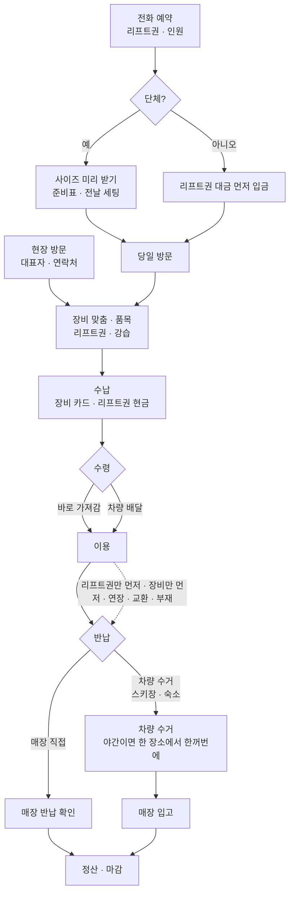

# 52. 업무 흐름 정리 · 화면 전체 점검 · 남은 UI 작업

작성 2026-09-23. 사용자 요청: "시스템 UI를 보고 전체적으로 더 개선해야 할 부분 체크, 아직 미진행된 UI 개선건 정리, 업무 프로세스 정리와 더 나은 방법 고민".

**점검·제안 문서다. 앱 코드는 바꾸지 않았다.** 새 화면은 지금까지처럼 **힉스필드 시안 → 검수(실제 크기) → 사용자 확인 → 구현** 순서로 진행한다.

- 기준: `main` = `feat/pos-ui-v4` = `a9739ed`(A6 헤더까지 Pages 반영된 상태).
- 방법: 로컬 빌드 뒤 기존 촬영 스크립트로 포스 60장(1024×600 · 1024×768 · 1366×768 · 907×648)과 기사 37개 상태를 새로 찍어 직접 봤다(화면 규칙 위반 0건). 기준 문서 `docs/16` · `35` · `46` · `51`과 코드를 대조하고, 의심 가는 흐름은 체험판에서 직접 재현했다. 촬영본은 저장소에 넣지 않았고, 아래 그림 링크는 이미 저장소에 있는 같은 화면의 촬영본이다.

## 0. 한눈에

- **뼈대는 잘 잡혀 있다.** 메뉴 `1 접수·예약 → 2 준비·지급 → 3 이용·변경 → 4 반납·회수 → 5 정산·마감`이 실제 업무 순서와 같고, 일부만 받음 · 리프트권 재전달 · 발권처 환불 · 차량 보관 · 매장 입고처럼 까다로운 변수도 자료 구조는 대부분 받쳐 준다. 큰 버튼, 끝 4자리 숫자판, 카드마다 버튼 하나, 잘린 글자 0건은 고령 사용자 기준에 맞다.
- **빈틈은 "현장에서 가장 자주 일어나는 조합"을 버튼으로 바로 고르지 못하는 곳에 몰려 있다.**
  1. **배달이 끊겨 있다(기능 결함).** 새 접수에서 배달 장소를 골라도 차량 배달 업무가 생기지 않고, 보이는 버튼(`지급`)을 누르면 매장에서 고객에게 직접 준 것으로 기록된다. 차량에 싣는 창은 코드에 있지만 여는 버튼이 없다. → N1
  2. **"매장에서 받아 가고 야간에 스키장에서 차량 반납"을 버튼으로 못 고른다.** 새 접수 3단계에 반납 장소 줄이 없고, 수령 장소를 따라간다. → N2
  3. **야간 일괄 수거에 쓸 '수거 목록'(포스트잇 대신)이 없다.** 장소·시간 묶음, 인쇄, 기사 화면 검색이 없다. → N3
  4. **강습 품목이 없다.** → N5
  5. **전화 예약의 선입금이 어렵다.** 접수 확정 창은 전부 수납 / 전부 나중 둘 중 하나이고, 예약금 개념이 없다. → N4
- **더 나은 방법의 핵심 세 가지** (2절)
  - 변수를 기능으로 늘리지 말고 **품목마다 "수령 · 반납 · 수납" 세 가지 약속**으로 통일해서 보여 준다. 리프트권만 먼저 반납, 숙소 수거, 야간 반납은 모두 "일부 품목의 반납 약속이 다르다"일 뿐이다.
  - **매장마다 다른 방식은 `매장 설정 → 사용 기능`으로 켜고 끈다.** 안 쓰는 기능은 버튼·메뉴에서 아예 사라지게 해서 화면을 줄인다.
  - **예외는 그 자리에서 처리한다.** 손님이 오면 `고객 찾기`(끝 4자리) → 접수 상세 → 늘 같은 자리의 버튼. 접수할 때 모든 예외를 미리 물어보지 않는다.

## 1. 업무 흐름 정리

### 1-1. 기본 흐름 두 가지

**(A) 현장 방문**

1. 방문 → 대표자 이름·연락처(일행 이름은 받지 않음 — `docs/46` 3절 "현장 대여는 대표자 이름만" 결정)
2. 장비 맞춤(직접 신어 보고 크기 확인) → 품목·수량
3. 리프트권 권종·수량, 강습 여부(**지금 시스템에 강습 없음**)
4. 결제 — 장비는 보통 카드, 리프트권은 보통 현금이라 나눠서 수납
5. 수령: 바로 가져감 또는 차량 배달(스키장 장소)
6. 반납: 매장 직접 또는 차량 수거(스키장 장소·시간). "오늘 야간까지 탄다" → 야간 차량 수거
7. 차량: 올라가기 전에 오늘 수거할 팀을 포스트잇에 적음(이름 · 연락처 · 장비 수량 · 반납 위치) → 야간에 먼저 올라가 대기 → 한꺼번에 받아 내려옴 → 매장 입고
8. 정산·마감

**(B) 전화 예약**

1. 전화로 리프트권과 인원 예약
2. 단체: 사이즈를 미리 받음 → 준비표 → 전날 장비 세팅 / 소규모: 리프트권 대금만 먼저 입금
3. 당일 방문 → 장비 맞춤 → 이후는 (A)의 4~8과 같음

### 1-2. 흐름 그림

### 1-3. 변수와 지금 시스템

판정: **됨** 버튼으로 바로 됨 · **우회** 되지만 숨은 양식이나 여러 단계를 거침 · **부족/없음** · **끊김** 동작이 잘못 기록됨.

| 변수 | 지금 시스템에서 하는 방법 | 판정 |
|---|---|---|
| 바로 가져감 + 매장 반납 | 새 접수 3단계 `매장 수령` → 반납 타임 버튼 | 됨 |
| 바로 가져감 + 야간 차량 반납 | 반납 시간 `직접` → 드롭다운·날짜칸·장소 글자 입력 양식(`pos-orders.js:495-507`)에서만 가능 | 우회 (N2) |
| 차량 배달(스키장 장소) | 수령 장소 구역 버튼 → 장소 창. **약속만 저장되고 배달 업무가 생기지 않음. `지급`을 누르면 매장 직접 지급으로 기록** | 끊김 (N1) |
| 배달 장소 ≠ 반납 장소, 배달 + 매장 직접 반납 | 장소를 고르면 반납도 같은 장소 차량 수거로 고정(`pos-orders.js:468`). 접수 뒤 `기간·수거 변경 → 수거 약속`으로 장소만 변경, 매장 직접으로 되돌리기는 미구현(`docs/51` P24) | 우회 / 없음 |
| 리프트권만 먼저 반납 | `리프트권` 메뉴 카드 `회수 N매`, 또는 반납 `일부만 받음`에서 권만 선택 | 됨 |
| 장비만 먼저 반납 · 일부 반납 | 반납 `일부만 받음` → 품목·수량 −/+ | 됨 |
| 일부 품목만 수거 약속 변경 | `수거 약속`은 품목 줄에서 고객이 가진 수량 전부를 옮김(`pos-fulfillment.js:185`) | 부족 |
| 숙소로 수거 | `기타` 구역에 숙소를 장소로 등록해 두면 버튼으로 가능. 없으면 장소 `직접 입력`(글자) | 됨(설정 필요) |
| 야간 일괄 수거 | 팀마다 따로 `업무 처리`. 장소·시간 묶음, 검색, 인쇄 없음 | 부족 (N3) |
| 고객 부재 · 못 받음 | 기사 `못 받음·고객 부재`(드롭다운·날짜칸 양식, D14 시안 미반영) | 됨 (N11) |
| 리프트권 다음 손님 재전달 · 발권처 환불 | 차량 업무 · `리프트권` 화면 | 됨 |
| 기간 연장 · 교환 | `기간·수거 변경`, `문제 해결·정정 → 교환`(교환은 스키·보드 줄만, `pos-fulfillment.js:225`) | 됨 / 부족 |
| 늦게 온 일행 · 장비 추가 | 접수 상세 `일행·장비 추가` | 됨 |
| 전화 예약 · 리프트권만 선입금 | 새 접수에서 리프트권만 담고 `수납하고 접수 확정`(계좌이체) | 됨 |
| 전화 예약 · 장비도 예약, 리프트권만 먼저 수납 | 접수 확정 창은 전부 수납 / 전부 나중(`pos-orders.js:543`) → `나중에 수납` 뒤 접수 상세 `수납·환불`에서 금액 입력 | 우회 (N4) |
| 예약금(일부 선입금) | 예약금 개념 없음(`finance.js`의 보증금과 다름). 수납으로 넣으면 카드에는 계속 `미수 N원` | 없음 (N4) |
| 인원만 예약(장비 미정) | 사이즈 요청은 사람별 장비 줄이 있어야 가능 | 부족 |
| 단체 사이즈 미리 받기 | `사이즈 요청` → 입력 링크 준비(문자 실제 발송 미연결) → 준비표·팀 스티커 인쇄 | 됨(발송은 수동) |
| 강습 | 없음(`docs/08`에서 시험 범위 밖으로 뺐던 항목) | 없음 (N5) |
| 방문 순서 변경 · 기사에게 알림 | 자료는 있음(`dispatch.reorder`, `task.priority`), 지금 포스에는 버튼 없음(예전 화면에만 있었음) | 없음 (N12) |
| 수거 목록 인쇄(포스트잇) | 없음. 인쇄는 준비표 · 팀 스티커 · QR 안내판만 | 없음 (N13) |
| 출발 문자 | 문구 확인만, 실제 발송 미연결 | 부족 |
| 자정 넘는 야간 영업일 | `야간 기준` 보류(날짜 계산에 적용 안 함) | 정책 대기 |

### 1-4. 매장마다 다른 것

| 항목 | 지금 |
|---|---|
| 수령 장소(구역) · 반납 타임 · 요금 · 할인 · 차량 · 직원 · 스키장 템플릿 | 매장 설정에서 바꿀 수 있음 |
| 기능 사용 여부(차량 · 리프트권 · 사이즈 요청 · 거래처 · 강습) | 바꿀 수 없음. 모든 매장에 모든 메뉴가 나옴 |
| 결제 시점 기본값(접수 때 / 지급 때 / 반납 때), 예약금 · 보증금 규칙 | 바꿀 수 없음 |
| 품목 종류(물건만) · 요금 방식(1일 · 1매) | 코드 고정 |
| 수령 시간 버튼 09:00 · 12:00 · 17:00 | 코드 고정(`pos-orders.js:346`) |
| 반납 타임의 날짜 차이 0~1일, 교환 가능 품목(스키·보드) | 코드 고정 |

## 2. 더 나은 방법

### 2-1. 변수는 "약속 세 가지"로 묶는다

어떤 변수든 결국 **"품목마다 수령 · 반납 · 수납 약속이 무엇이고, 실제로 몇 개가 오갔나"** 다. 자료 구조(`pickupPlan` · `returnPlan` · 수납 기록 · 실물 이동)는 이미 이렇게 돼 있으니, 화면이 이 세 가지를 같은 말로 보여 주기만 하면 된다.

| 상황 | 수령 | 반납 | 수납 |
|---|---|---|---|
| 현장 대여 · 오후 반납 | 매장 · 지금 | 매장 직접 · 오후타임 후 16:30 | 접수 때 |
| 현장 대여 · 야간까지 | 매장 · 지금 | 차량 · 설천 주차장 · 야간타임 후 22:00 | 접수 때 |
| 배달 | 차량 · 만선 광장 · 09:00 | 차량 · 같은 곳 · 16:30 | 접수 때 또는 매장에서 |
| 숙소 수거 | 매장 · 지금 | 차량 · ○○콘도 로비 · 익일 오전 | 접수 때 |
| 리프트권만 먼저 | — | **리프트권 줄만** 반납 약속이 다름 → 그때 `일부만 받음` | — |
| 전화 예약(리프트권만 선입금) | 매장 · 내일 | 매장 직접 | 리프트권 먼저 · 장비 당일 |

화면에 옮기면:

1. **새 접수 3단계에 `반납 장소` 줄을 넣는다.** 버튼은 `매장 직접 · 만선 › · 설천 › · 기타 ›`, 기본값은 수령과 같게(매장 수령이면 매장 직접). 장소 창은 수거 약속 변경 창(P24)과 같은 구성을 재사용한다. 지금 3단계는 다섯 줄이 1024×600 왼쪽 판(약 390px)을 채우고 있어 여섯째 줄은 줄 간격을 줄여야 들어간다(52px 버튼 6줄 기준 실측 필요).
2. **카드 · 접수 상세 · 기사 화면에 "포스트잇 한 줄"을 쓴다.** `김민수 팀 · 010-…-0025 · 스키 4 · 헬멧 2 · 반납 오늘 22:00 설천 주차장(차량)`. 직원들이 이미 손으로 쓰는 형식이라 새로 배울 것이 없다.
3. **예외는 품목 단위 약속 변경으로.** "리프트권만 16:30에 차량으로" 같은 경우 품목 줄을 골라 약속만 바꾼다(지금 `수거 약속`은 줄 전체를 옮긴다 — 1-3 표).

### 2-2. 매장 방식은 `사용 기능`으로 켜고 끈다

`매장 설정`에 `사용 기능` 탭을 두고 사용/미사용을 고른다. **끈 기능은 비활성 회색 버튼으로 남기지 않고 화면에서 사라진다.** 자료는 지우지 않는다. 매장마다 코드를 나누지 않고 다른 방식을 지원하는 방법이고(`docs/04` 여러 매장 구조), 고령 사용자에게는 보이는 버튼 자체가 줄어든다. 1024×600 메뉴는 이미 9개가 한도라(항목 높이 약 53.8px, 하한 52px) 기능을 더할수록 이 장치가 필요하다.

| 설정 | 끄면 사라지는 것 | 스키노트 기본(사장님 확인 필요) |
|---|---|---|
| 차량 배달 · 수거 | `차량 운행` 메뉴, 수령·반납 장소의 구역 버튼, 기사 화면 | 사용 |
| 야간 수거 | 수거 목록의 야간 묶음 · `지금 처리`의 출발 준비 안내 | 사용 |
| 리프트권 대행 | `리프트권` 메뉴, 품목의 리프트권 칸, 접수 확정의 리프트권 칸 | 사용 |
| 강습 | 강습 칸 · 강습 목록 | 사용(신규) |
| 사이즈 미리 받기 | `사이즈 요청` 버튼 · 사이즈 입력 현황 | 사용(단체) |
| 예약금 | 접수 확정의 예약금 버튼 | 확인 필요 |
| 보증금 | 보증금 줄 | 확인 필요 |
| 결제 시점 기본값 | (접수 확정 창의 처음 선택) 접수 때 / 지급 때 / 반납 때 | 접수 때 |
| 거래처 장부 | 관리의 거래처 칸, 마감의 거래처 칩 | 사용 |

### 2-3. 예외는 그 자리에서: 고객 찾기 → 접수 상세 → 같은 버튼

- 카운터의 기본 동작을 **"손님이 오면 오른쪽 위 `고객 찾기` → 전화번호 끝 4자리 → 그 팀 화면 → 아래 주황 버튼"** 하나로 정한다. 메뉴 1~5는 목록을 보고 미리 준비할 때 쓰고, 손님 응대에는 어느 단계 메뉴에 있는지 몰라도 된다.
- 지금 `고객 찾기`는 일부 화면 헤더에만 있고 `3 이용·변경` 목록으로 이동한다(`pos-shell.js:59`). 모든 화면 헤더에 두고, 새 접수 1단계와 같은 숫자판으로 모든 접수를 찾게 바꾼다.
- 접수 상세의 고정 버튼 여섯 개(`일행·장비 추가 · 사이즈 요청 · 기간·수거 변경 · 수납·환불 · 문제 해결·정정 · 전화`)와 아래 주 버튼 하나가 모든 예외의 입구다. 이미 있는 구조이므로 교육 문장도 "모르면 고객 찾기"로 짧아진다.

### 2-4. 야간 수거: 포스트잇을 `수거 목록`으로

- **매장(출발 전):** `차량 운행 → 수거 목록`. 날짜 · 반납 타임 · 장소로 묶어 보여 준다. 예 `오늘 야간타임 후 22:00 · 설천 주차장 · 12팀 · 스키 20 · 보드 6 · 헬멧 9`. 팀마다 포스트잇 한 줄. `수거 목록 인쇄`(A4 한 장, 라벨 프린터가 정해지면 팀별 라벨)와 기사 기기 전송을 같이 한다. `docs/35`에 문구(`수거 목록 인쇄` · `미반납 목록 인쇄`)가 이미 정해져 있다.
- **기사(현장):** 묶음 화면 = 그 장소·시간의 팀 목록. 위에 끝 4자리 숫자판 검색, 팀마다 큰 `모두 받음` · `일부만 받음`, 받은 팀은 아래로 내리고 안 온 팀은 위에 남기며 `전화` 버튼을 행에 둔다. 촘촘한 행 목록·쪽 나눔 규칙(기사 화면 예외)은 그대로 지킨다.
- **내려와서:** `매장 입고 N개` 한 번(A5에서 구현됨) → 매장 `차량 입고 확인`.
- **시간 맞춰 알려 주기:** 야간타임 한 시간 전쯤 `오늘 할 일`의 `지금 처리`에 `야간 수거 준비 · 설천 주차장 12팀`을 띄운다.
- **통신 대비:** 밤 주차장은 전파가 약할 수 있다. 인쇄한 수거 목록에 체크해 두었다가 내려와서 입력하는 방법을 기본 대비책으로 두고, 기기 안 임시 보관은 운영 서버 구조(`docs/34`)와 함께 따로 검토한다.

### 2-5. 강습: 물건이 아닌 품목

- 새 접수 2단계 품목 칸에 `강습`을 넣고, 누르면 창에서 종류(스키·보드) · 인원 · 시간(오전 · 오후 · 직접) · 강사(선택) · 금액을 버튼으로 고른다.
- **재고 · 지급 · 반납 대상이 아니다.** 지금 품목은 모두 실물이라는 전제가 있어(주문 상태가 "모두 돌아와야 반납 완료", `orders.js:238-276`) 강습을 장비 요금에 끼워 넣으면 반납이 영원히 안 끝난다. 상태는 `예약 → 완료 / 취소`로 따로 둔다.
- 접수 확정 창에 `강습` 칸이 필요하다. 지금 창은 폭 880px에 장비 · 리프트권 두 칸이 나란히 있어, 세 칸으로 늘리면 칸 폭이 약 280px가 되어 할인 버튼 네 개가 들어가지 않는다. 강습을 장비 칸에 합칠지(할인 공통), 따로 줄을 둘지 시안으로 먼저 본다(창 높이 537px · 한도 552px, 2026-09-23 실측).
- 강습 목록(시간대별, 강사에게 전달용)은 메뉴 자리가 없으므로 `리프트권` 메뉴를 `리프트권·강습`으로 합치는 안을 추천한다. 둘 다 "실물 장비가 아니라 다른 곳(발권처·강습)과 연결되는 판매"라서 성격이 같다.
- 강사·스키학교 정산은 거래처 장부(거래처 = 강사/스키학교)를 그대로 쓸 수 있다.
- 사장님께 운영 방식을 먼저 확인해야 한다(6절).

### 2-6. 전화 예약: 칸별 수납과 예약금

- 접수 확정 창의 **칸(장비 · 리프트권)마다 수납을 따로** 정하게 한다. 가장 가벼운 방법은 칸마다 있는 결제 수단 줄 `카드 · 현금 · 계좌이체` 끝에 **`나중에`** 를 네 번째 버튼으로 넣는 것이다 — 줄이 늘지 않아 창 높이(537px · 한도 552px)가 그대로다. 리프트권만 입금받은 전화 예약, "리프트권 현금 · 장비는 반납 때" 같은 경우가 한 번에 끝난다. 아래 주 버튼 문구는 실제로 받는 금액만 보여 준다(`수납하고 접수 확정 · 35,000원`).
- **예약금:** 칸의 `받을 금액`을 눌러 일부 금액만 받게 하고, 그 수납을 예약금으로 표시한다. 카드에는 `예약금 5만 수납 · 잔액 N원`처럼 보여 준다. A5에서 보류한 기사 화면의 `예약금 미수` 안내도 이 자료가 생기면 풀린다.
- **인원만 예약:** 새 접수에 `인원 N명 · 장비 당일` 한 줄을 허용하고, 당일 `일행·장비 추가`로 채운다.

### 2-7. 고령 사용자를 위한 화면 원칙(추가)

1. **화면마다 주황 버튼은 "지금 가장 자주 하는 일" 하나.** `오늘 할 일`의 주 버튼은 낮에는 `새 접수`, 마지막 반납 타임 뒤에만 `마감`. (N7)
2. **빨강은 "늦었다"에만.** 반납 지연 · 지급일 지남 · 수거 지연 · 발권 기한 지남. 반납 때 받기로 한 정상적인 미수는 검정 글자. 지금은 미수가 있으면 모든 카드가 빨강이라 진짜 급한 것이 묻힌다. (N8)
3. **날짜는 `오늘 · 내일 · 모레` 글자로.** 카드의 `9/23 수령 · … · 9/23 이용`처럼 같은 날짜를 두 번 쓰지 않는다. (N14)
4. **드롭다운 · 날짜칸 · 글자 입력은 `직접 입력` 뒤로만.** 포스 화면 코드에 이런 입력이 약 60곳 남아 있다(관리 설정 24곳 포함). 매장 업무 흐름에 있는 것부터 버튼으로 바꾼다: 반납 일정 `직접`, 기사 방문 결과, 적재 확인, 발권처 입력.
5. **메뉴 표시는 온 곳을 유지한다.** (N9)
6. **카드에는 상태 하나 + "다음 할 일" 한 줄.** 지금은 테두리 배지와 품목 줄 배지가 동시에 있어 어느 것이 상태인지 헷갈릴 수 있다.
7. **연습과 관찰.** 매장 포스에 `연습` 로그인(체험 자료)을 두고, 시즌 전에 부모님과 직원 세 분 이상이 다섯 과업(현장 대여 · 야간 반납 약속 · 리프트권만 먼저 반납 · 전화 예약 · 마감)을 직접 해 보는 것을 지켜본다. `docs/34`의 "최소 3명 과업 관찰"이 아직 남아 있다.
8. **종이와 같이 간다.** 준비표 · 팀 스티커 · 수거 목록을 인쇄할 수 있으면 전환기에 불안이 줄고 통신이 끊겨도 일이 멈추지 않는다(`docs/16` 9절, 라벨 프린터 결정과 연결).

## 3. 화면 점검 결과 — 이번에 새로 찾은 것

우선: **높음** 시즌 전에 꼭 · **중간** 실수를 줄임 · **낮음** 다듬기.

| # | 우선 | 화면 | 지금 | 제안 |
|---|---|---|---|---|
| N1 | 높음 | 배달 접수 → 차량 | 수령 장소를 고르면 배달 약속만 저장되고 배달 업무가 생기지 않는다. `2 준비·지급` 카드와 접수 상세의 버튼은 모두 `지급`(`ops.issue`, 매장 직접 지급)이다(`pos-orders.js:111`, `:229`). 적재 창(`pos-fulfillment.js:124-133`)과 동작 `pos-dispatch-order`(`pos-dispatch.js:145`)는 있지만 여는 버튼이 한 곳도 없다(첫 포스 커밋 `1e27f7c`부터). 기사 화면의 배달 업무는 검사 스크립트가 API로 직접 만든 것이다(`capture-pos-driver.cjs:44`). **재현:** 새 접수 → 스키 1 → `만선 › 티롤 앞` → `나중에 수납` → 배달 업무 0건 → `준비·지급하기 → 선택 물품 지급 확정` → 고객 보유 1 · 이용 중으로 기록, 반납 수거 업무만 생김 | 배달 약속이 있는 접수는 카드·상세의 주 버튼을 `차량 적재 N개`로 바꾸고, 차량 · 날짜 · 시간 · 장소는 약속에서 채워 버튼으로 확인한다. `차량 운행`의 `배달할 팀 찾기`는 적재 대기 목록을 연다. 바꿀 때 업무 검사에 "UI로 만든 배달 접수 → 적재 → 기사 전달" 흐름을 넣는다 |
| N2 | 높음 | 새 접수 3단계 | 반납 장소 줄이 없다. 장소를 고르면 반납도 같은 장소 차량 수거, `매장 수령`이면 매장 직접 반납으로 고정된다(`pos-orders.js:468`). 다른 조합은 `직접` 양식(드롭다운 · 날짜칸 · 장소 글자 입력)에서만 된다 | 2-1의 `반납 장소` 줄. 그림: [현재 3단계](pos-ui-v4/group-review-1024x600.png) |
| N3 | 높음 | 차량 운행 · 기사 목록 | 포스는 차량별 카드만, 기사는 시간순 행(1024×600에서 한 쪽 4줄)만 있다. 장소·시간 묶음, 검색, 행의 전화번호(`pos-dispatch.js:37-42`), 인쇄가 없다. 한 장소 10팀이면 10번 따로 처리한다 | 2-4의 `수거 목록` (포스 목록 · 인쇄 · 기사 묶음 화면) |
| N4 | 높음 | 접수 확정 창 | 전부 수납 / 전부 나중 둘 중 하나(`pos-orders.js:543`). 예약금 없음 | 2-6: 결제 수단 줄에 `나중에` 추가(높이 그대로), `받을 금액`으로 예약금 |
| N5 | 높음 | 품목 | 강습 없음 | 2-5 (사장님 확인 뒤 시안) |
| N6 | 중간 | 4 반납·회수 카드 | 차량 수거 예정인 팀에도 주황 `모두 받음`이 뜬다(`pos-orders.js:109`). 야간 차량 수거 팀을 카운터에서 잘못 받을 수 있고, 매장 직접 반납 팀과 한 묶음에 섞인다 | 차량 수거 팀은 `차량 수거 대기 · 22:00 설천 주차장` 표시 + 보조 버튼 `매장 반납 확인`. 목록은 매장 직접 / 차량 수거로 나눠 묶는다. 그림: [4 반납·회수](pos-ui-v4/returns-1024x600.png) |
| N7 | 중간 | 오늘 할 일 | 아래 주황 버튼이 `마감`이고 `새 접수`는 흰 버튼이다(`pos-orders.js:183`) | 낮에는 `새 접수`가 주 버튼. 그림: [오늘 할 일](pos-ui-v4/home-1024x600.png) |
| N8 | 중간 | 공통 색 | `오늘 할 일` 여섯 칸 중 네 칸이 빨간 테두리, `미수 7팀`이 두 칸에 중복, 미수가 있으면 모든 카드 금액이 빨강(`pos-orders.js:107`). 접수 확정 창의 `할인 없음`도 빨간 글자다 | 빨강은 늦은 것만(2-7의 2) |
| N9 | 중간 | 접수 상세 | 어디서 열어도 메뉴가 `3 이용·변경`으로 바뀐다(`pos-orders.js:589`의 `parent: 'rentals'`). 새 접수를 끝내면 `1 접수·예약`에 있던 표시가 갑자기 옮겨 간다 | 온 메뉴를 유지 |
| N10 | 중간 | 헤더 `고객 찾기` | 일부 화면에만 있고 `3 이용·변경` 목록으로 간다(`pos-shell.js:59`) | 2-3의 공통 숫자판 찾기 |
| N11 | 중간 | 기사 `못 받음·방문 결과` | 드롭다운 · 날짜칸 · 시간칸 · 글자 입력 양식(`pos-dispatch.js:139`). 장갑 낀 손·휴대폰에서 어렵다. D14 시안(`고객 부재 / 장소 변경 / 물품을 받지 못함`, `오늘 다시 / 내일 / 달력`, `16:30 / 17:00 / 직접 입력`)이 있는데 A5 범위에서 빠졌다 | [D14 시안](../design/higgsfield/driver-phone-v1/d14-phone-visit-result.jpg)대로 버튼화 |
| N12 | 중간 | 차량 운행 | 방문 순서 `▲ ▼` · `시간순 되돌리기` · `기사에게 알리기`, 우선 확인 요청이 없다. 자료는 있다(`dispatch.js:17`, `:82`), 예전 화면(`workflow-ui.js:166-169`)에만 있었다 | `docs/16` 7절 · `docs/35` 차량 운행 행대로 연결 |
| N13 | 중간 | 인쇄 | 준비표 · 팀 스티커 · QR 안내판만 된다. `수거 목록` · `미반납 목록` · `마감표` · `재고 목록` · `장부 인쇄` 없음 | 수거 목록부터(N3), 나머지는 마감·관리 정리 때 |
| N14 | 낮음 | 목록 카드 둘째 줄 | `9/23 수령 · 매장 수령 · 9/23 이용 · R-021` — 같은 날짜 두 번, 오늘/내일 대신 숫자 날짜 | `오늘 수령 · 매장 · R-021`, 여러 날이면 `오늘~내일 이용` |
| N15 | 낮음 | 1 접수·예약 목록 | 지급 완료 팀도 같은 순서로 섞여 앞쪽을 차지한다(`keep`이 항상 참, `pos-orders.js:125-128`) | 처리할 팀을 먼저, 끝난 팀은 뒤로 흐리게 |
| N16 | 낮음 | 기사 업무 목록 아래 요약 | 차량을 설정에서 못 찾으면 내부 코드(`van-1`)가 그대로 보인다(`pos-dispatch.js:8`, 차량 보관 화면은 `1호 차량`으로 정상) | 차량 보관 화면과 같은 이름 출처 사용 |
| N17 | 낮음 | 교환 | 스키·보드 줄에만 `교환` 버튼(`pos-fulfillment.js:225`). 의류·헬멧 사이즈 교환 없음 | 사장님 확인 뒤 의류·헬멧도 |
| N18 | 낮음 | 2 준비·지급 | 일행을 만든 현장 대여 팀은 카드 버튼이 `지급` 대신 `사이즈 요청 N명`이 된다(`pos-orders.js:111`). 카운터에서 맞춘 팀에는 필요 없는 요청이다 | 오늘 수령 · 매장 수령이면 `지급`을 먼저 |

**유지할 것(잘 된 점):** 번호 붙은 메뉴 1~5, 끝 4자리 숫자판, 카드마다 버튼 하나, `지금 처리` 한 줄, 창의 −/+ 수량과 `수량 설정`, 확정 전 요약 창, 잘린 글자·반쯤 잘린 카드 0건, 헤더의 `처리 대기`, 접수 상세의 고정 버튼 여섯 개와 아래 주 버튼, 기사 화면의 촘촘한 행·56px 버튼.

## 4. 아직 안 된 UI 개선건 — 기존 기록 모음

`docs/46` · `docs/51` · `docs/44` · `docs/45` · `docs/34`에 흩어져 있던 것을 한곳에 모았다. 3절(N1~N18)은 이번에 새로 찾은 것이라 여기서는 빼고 겹치는 것만 표시했다.

### 4-1. 시안과 아직 모양이 다른 곳 (`docs/51`)

| 화면 | 남은 차이 |
|---|---|
| 공통 헤더 (A6 후속) | 헤더 안 세로 구분선, `처리 대기` 칩 모양(시안은 회색 알약), 메뉴 아이콘 종류 · 구분선 · 관리 메뉴 간격 |
| M02 재고·정비 | 헤더 상태가 시안 `정비 중 N개` 대신 `처리 대기 정비 N개` |
| M04 거래처 상세 | 1024px에서 왼쪽 판 260px로 좁음, 여섯 버튼 구성 다름 — **`docs/46`이 정한 다음 순서** |
| P14 사이즈 입력 현황 | `발송 M/D 시각` 알약, `현장 측정 N명`, `준비표 인쇄` |
| P24 수거 약속 변경 | `매장 직접` 전환(차량 수거 → 매장 직접 반납) 미구현 |
| D02 · D12 기사 업무 처리 | `예약금 N원 미수` 안내 띠 — 사용자 보류(2-6의 예약금이 생기면 풀림) |
| D14 방문 결과 | 버튼 시안 미반영 — N11 |

### 4-2. 기능 · 자료가 없어 비워 둔 곳

- M02 `재고 목록 인쇄`, M04 `장부 인쇄` · `전화` 버튼, 거래처 담당자 · 단가×일수 요금 (N13과 같은 묶음)
- 고객 상세 전용 시안 없음(P04 배치를 빌려 씀)
- 출발 문자 · 사이즈 입력 요청 **실제 문자 발송**(매장 발신번호 · 문자 업체 · 발송 결과 기록)
- 방문 순서 변경 · 우선 확인 요청 화면 — N12

### 4-3. 시안만 있고 구현 전

- **나눠서 결제 S08R**(`docs/44` 6-1): 품목·수량을 골라 한 묶음씩 결제. 카드 단말을 붙일 때 구현. 접수 확정 창에 입구가 없고 높이 여유가 적다 — N4의 창 재배치와 같이 설계하는 것이 좋다.
- **관리자 콘솔 8장**(`docs/45`): 운영 서버의 아이디·비밀번호 로그인이 먼저. 사용자가 정할 것 다섯 가지(라이선스 단위 · 역할 · 로그 보관 · `시스템 설정` 항목 · 인증 방식)가 남아 있고 `시스템 설정` 시안은 없다. Pages 체험판에는 넣지 않는다.

### 4-4. 정리 · 기타 (`docs/46` D~F)

- 스키장 템플릿의 실제 값(`resortTemplates` · `templateTimes`는 예시) — 실제 DB 연결 때
- 남은 예전 코드 약 150KB(`workflow-ui.js` 등) 정리 — 지울 때 N12의 예전 순서 변경 코드를 참고용으로 먼저 옮겨 둘 것
- 매장 포스의 실제 표시 영역(`관리 → 매장 설정 → 매장 정보`의 `이 화면 크기`)을 받아 촬영 크기에 추가
- 지운 예전 화면을 설명하는 옛 문서(`docs/12` · `13` · `14` · `24` · `26` · `29`) 첫머리에 "예전 화면 · 2026-09-21 삭제" 표시
- 접수 확정 창의 저장 응답이 끊겨 `앞선 처리 다시 확인`으로 되살린 접수는 수납이 빠진다 — 되살린 뒤 수납 창을 바로 여는 개선
- 새 접수 2단계 `이번 접수 내역` 3줄 고정 — 768 이상에서 더 보이게

### 4-5. 현장 인수 전에 정할 것 (`docs/34`)

실제 포스 기종·표시 영역·기사 기기, 야간 영업일 경계, 요금·할인·보증금·배상·환불 정책, 프린터 용지·드라이버, 문자 업체, 카드 단말, 최소 3명 과업 관찰, 실제 자료 이관 대조, 운영 주소·백업 담당.

## 5. 추천 순서

시즌(12월) 전 약 10주. 새 화면은 모두 시안 → 검수 → 확인 → 구현.

| 단계 | 시기 | 할 일 | 시안(3 크레딧/장) |
|---|---|---|---|
| 0 | 지금 | 6절 질문을 사장님께 확인 | — |
| 1 | 10월 | **N1 배달 적재 연결**(기존 창 재사용이면 시안 없이 가능, 결함 수정 성격) → **N2 반납 장소 줄** → **N3 수거 목록**(포스 목록 · 인쇄 미리보기 · 기사 태블릿 묶음 · 기사 휴대폰 묶음) → **N4 칸별 수납·예약금** → 작은 수정 N6 · N7 · N8 · N9 | 약 7장 · 21 크레딧 |
| 2 | 11월(연습 기간) | **N5 강습**(품목 창 · 접수 확정 · 강습 목록) → `사용 기능` 설정 → N10 고객 찾기 → N11 방문 결과 → N12 방문 순서 → **관찰 시험 후 고치기** | 약 5장 · 15 크레딧 |
| 3 | 시즌 중 여유 때 | 4-1 모양 차이(M04부터), 인쇄 나머지, 나눠서 결제(카드 단말), 관리자 콘솔(로그인 먼저), 예전 코드 정리 | 필요할 때 |

## 6. 사장님께 확인할 것

화면은 가게에서 실제로 일하는 방식을 그대로 옮겨야 한다. **강습 · 야간 수거 · 예약금은 그 방식을 아직 모른다.** 모르는 채로 화면 그림(시안)을 그리면 추측으로 그리게 되고, 틀리면 다시 그려야 해서 크레딧과 시간이 두 번 든다. 그래서 이 세 가지는 답을 받은 뒤에 그린다.

10월 작업과의 관계: **배달 적재 연결(N1)** · **반납 장소 줄(N2)** · **칸별 수납의 `나중에` 버튼(N4 일부)** 은 답 없이 바로 시작할 수 있다. **수거 목록(N3)** 은 2번 답, **예약금(N4 나머지)** 은 3번 답이 있어야 그릴 수 있다.

### 6-1. 강습 — 누가, 어떻게 가르치는지

답에 따라 화면이 완전히 달라진다.

- **우리 매장 강사가 가르치면:** 강습을 받을 때 강사를 고르는 버튼이 필요하고, 같은 시간에 강사가 겹치지 않게 강사별 일정도 봐야 한다.
- **스키학교에 연결만 해 주면:** 강사 대신 "스키학교에 넘길 돈"을 적어 두고, 나중에 스키학교와 정산하는 기록(거래처 장부)이 필요하다.

여쭤볼 것
- 강습은 누가 가르치나요? (우리 강사 / 스키학교 연결 / 둘 다)
- 어떻게 파나요? (1:1인지 단체인지, 오전·오후처럼 시간이 정해져 있는지)
- 손님에게 받는 값과 강사(스키학교)에게 주는 돈은 각각 얼마인가요?
- 다음 날 강습 명단은 강사에게 어떻게 전하나요? (종이 / 문자 / 전화)

### 6-2. 야간 수거 — 밤에 차가 어디서, 언제까지 기다리는지

- **차가 서는 곳이 매일 한 곳이면** 수거 목록을 한 장으로 단순하게, **여러 곳이면** 장소별로 나눠 도는 순서대로 만든다.
- **올라가는 시각을 알면** 그 전에 화면에 `야간 수거 준비 · 설천 주차장 12팀`처럼 미리 알려 줄 수 있다.
- **안 온 손님을 어떻게 하는지 알면** 기사 화면에 그 버튼을 만든다. 예) `내일 매장 반납` · `내일 아침 숙소 수거`

여쭤볼 것
- 밤에 차가 서는 곳은 매일 같나요? 몇 군데인가요?
- 몇 시에 올라가서 몇 시까지 기다리나요?
- 끝까지 안 온 손님은 보통 어떻게 하나요?

### 6-3. 예약금 — 전화 예약 때 돈을 얼마나 먼저 받는지

- **리프트권 값만 전부 먼저 받으면:** 접수 확정 창에 `나중에` 버튼만 더하면 된다(리프트권은 지금, 장비는 나중에). 예약금 칸은 따로 필요 없다.
- **정해진 금액을 받으면**(예: 팀당 5만 원): 예약금 금액 버튼이 필요하고, 당일에는 예약금을 뺀 나머지만 받도록 계산해야 한다.
- **취소하거나 안 오면 돌려주는지에 따라:** 취소할 때 `예약금 환불` / `환불 없음`을 고르는 칸이 필요한지가 정해진다.

여쭤볼 것
- 전화 예약 때 무엇을 먼저 받나요? (리프트권 값 전부 / 정해진 예약금 / 안 받음)
- 입금은 어떻게 확인하나요? (통장 확인 / 입금 문자 등)
- 예약하고 안 오면 돌려주나요? 전날 취소하면요?

### 6-4. 급하지 않은 것 다섯 가지

화면 모양은 그대로 두고 버튼 몇 개나 처음에 선택돼 있는 값만 정해진다. 알게 될 때 반영한다.

| # | 여쭤볼 것 | 답으로 정해지는 것 |
|---|---|---|
| 4 | 현장 대여는 장비를 줄 때 전부 받나요, 반납할 때 받는 경우도 있나요? 보증금을 받나요? | 접수 확정 창에서 처음에 선택돼 있을 값 |
| 5 | 리프트권만 먼저 받는 건 남은 시간을 환불받으려는 건가요, 다음 손님에게 다시 주려는 건가요? | 권을 받은 뒤 `환불`과 `다음 손님` 중 무엇을 먼저 보여 줄지(둘 다 자료는 지원) |
| 6 | 자주 가는 숙소 이름은요? | 매장 설정 `기타` 구역에 미리 넣어 두면 글자를 치지 않고 버튼으로 고름 |
| 7 | 옷이나 헬멧도 사이즈를 바꿔 주나요? | 지금은 스키·보드에만 교환 버튼이 있음(N17) |
| 8 | 배달 가서 기사님이 돈을 받는 경우가 있나요? | 있으면 기사 화면에 받을 금액이 보여야 함(지금 기사에게는 금액 자료를 보내지 않는다) |

## 7. 점검 기록

- 빌드 후 `SKI_SCREENS_OUT=<임시 폴더> node scripts/capture-pos-release.cjs` → 60장 · 규칙 위반 0건, `SKI_DRIVER_OUT=<임시 폴더> node scripts/capture-pos-driver.cjs` → 37개 상태 통과. 저장소의 촬영본은 바꾸지 않았다.
- N1은 체험판에서 Playwright로 재현했다(위 표의 재현 절차 · 배달 업무 0건 → 지급 뒤 `customerQuantity 1`, `status in_use`, `collection` 업무 1건).
- 이 문서 외에 저장소 파일 변경 없음. 사용자 파일 `docs/25-label-printer-purchase-notes.md`는 건드리지 않았다.
